<p align="center">
  <a href="https://github.com/magele758/hyper-vibekanban">
    <picture>
      <source srcset="packages/public/vibe-kanban-logo-dark.svg" media="(prefers-color-scheme: dark)">
      <source srcset="packages/public/vibe-kanban-logo.svg" media="(prefers-color-scheme: light)">
      
    </picture>
  </a>
</p>

<p align="center">Saca 10× más de Claude Code, Gemini CLI, Codex, Cursor, Pi y otros agentes de código...</p>
<p align="center">
  <a href="https://www.npmjs.com/package/vibe-kanban"></a>
  <a href="https://github.com/magele758/hyper-vibekanban/blob/main/.github/workflows/publish.yml"></a>
</p>

<p align="center">
  <a href="README.md">English</a> |
  <a href="README.zh-Hans.md">简体中文</a> |
  <a href="README.zh-Hant.md">繁體中文</a> |
  <a href="README.ja.md">日本語</a> |
  <a href="README.ko.md">한국어</a> |
  <a href="README.fr.md">Français</a>
</p>

> **Nota:** La nube oficial de Vibe Kanban ha sido discontinuada. Este repo es un fork de [BloopAI/vibe-kanban](https://github.com/BloopAI/vibe-kanban) (hyper-vibekanban): **se mantienen todas las capacidades del upstream**, más una nueva capa de **board-agent dinámico** y Remote autoalojado.

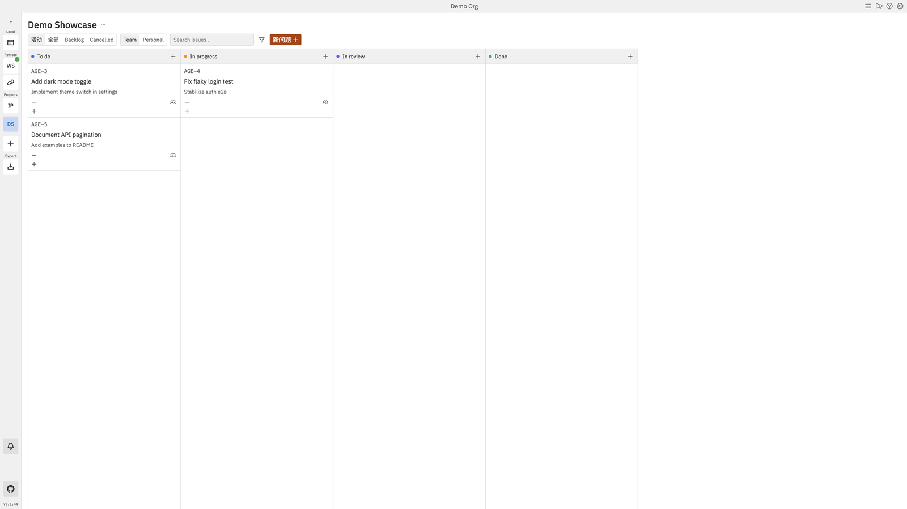

## vs upstream: qué conservamos / qué añadimos

Upstream es un sólido banco de trabajo de agentes + kanban basado en “abrir un Workspace a mano”. Este fork lo conserva intacto y añade **evento de tablero → encolar automáticamente → ejecutar → escribir de vuelta**, más un reemplazo autoalojado de la nube retirada.

### ✅ Heredado del upstream (conservado por completo)

| Capacidad | Qué es |
|------------|------------|
| **Kanban issues** | Crear / prioridad / etiquetas / sub-issues / Team·Personal |
| **Workspace + git worktree** | Elegir un agente, worktree aislado, stream de logs en vivo |
| **Sessions & follow-ups** | Chat multi-sesión, adjuntos, @-files |
| **Inline diff review** | Unified / side-by-side; los comentarios vuelven al agente |
| **App preview** | Navegador integrado, DevTools, inspect, emulación de dispositivos |
| **Coding agents** | Claude Code, Codex, Gemini, Copilot, Amp, Cursor, OpenCode, Droid, CCR, Qwen |
| **Git / PRs** | Rebase, UX de conflictos, descripciones de PR con IA, merge de GitHub / Azure |
| **MCP + Review CLI** | `npx vibe-kanban --mcp` / `review` |
| **Settings** | Agent profiles, MCP, integración de editor, notificaciones, org / projects |

El flujo clásico sigue funcionando: **issue → abrir Workspace a mano → logs → revisar diff → PR**.

### ✨ Añadido en este fork (no está en upstream)

| Capacidad | Qué es |
|------------|------------|
| **Board Agents** | Los agentes son de primera clase en el tablero; **assign → enqueue**; un watcher local abre un Workspace y escribe progreso / comentarios de vuelta |
| **Project Copilot** | Chat del tablero (Cursor SDK por defecto) para aclarar trabajo y sugerir asignaciones — **no** es el ejecutor de código que edita archivos |
| **Squad DAG** | Pipelines multi-agente: Fork / Join / If / While; editor de lienzo; chat-to-pipeline opcional |
| **Autopilot** | Cron + zona horaria; crear issues o ejecutar un agent / squad; skip / queue por concurrencia |
| **Webhooks** | POST externo → crear issue / encolar trabajo |
| **Feishu bot** | Mensaje de Feishu → cola de issues; respuesta opcional al terminar |
| **Console workspaces** | Ejecutar en el **dir / branch actual** del repo sin forzar un worktree nuevo |
| **Host picker on create** | Ejecutar un workspace en esta máquina o en un remote worker emparejado |
| **Mobile board layout** | Columna única + pills de estado para teléfonos |
| **Pi coding agent** | Pi CLI como ejecutor adicional de Workspace |
| **Self-hosted Remote stack** | Docker Remote + Relay + ElectricSQL tras el cierre de la nube (`scripts/vk-*.sh`) |

### 🔄 Mejorado frente al upstream

| Área | Upstream | Este fork |
|------|----------|-----------|
| Remote Access | Emparejamiento con la nube oficial | Remote / Relay **self-hosted**; SOP worker-host |
| Board | Tarjetas estáticas + Workspace manual | **Agents / squads asignables** con escritura de progreso |
| Triggers | UI / MCP crean Workspace | También: assign, @, Autopilot, webhook, Feishu |

---

## Demostración de funciones

Solo datos de demo (Demo Org / Demo Showcase). Marcado **[Nuevo]** / **[Heredado]**.

### 1. [Nuevo] Tablero dinámico + Board Agents

Asigna un agente en el tablero; la ejecución se encola automáticamente y se escribe de vuelta.


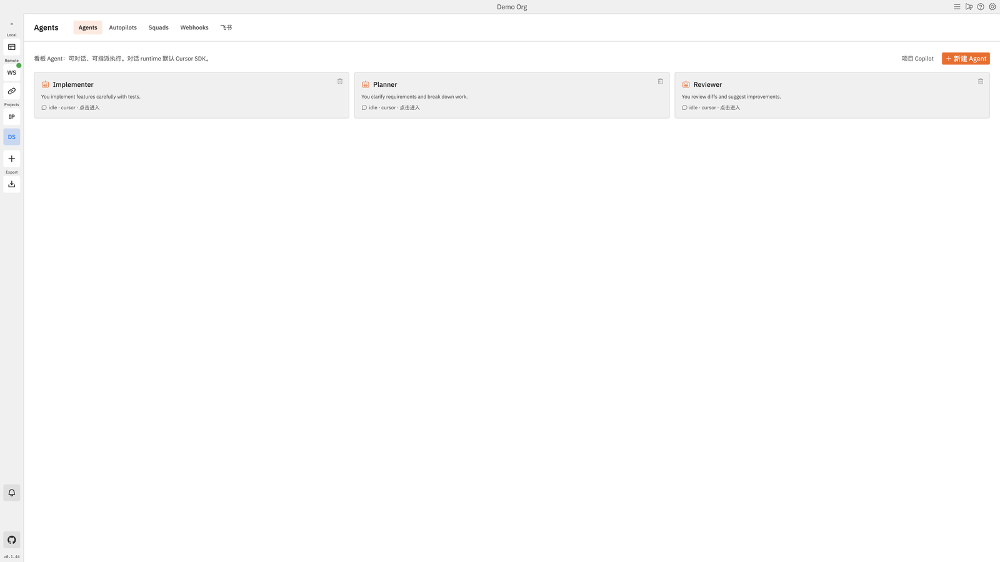

### 2. [Nuevo] Project Copilot

Capa de chat/orquestación para aclarar el trabajo; el código sigue ocurriendo en los ejecutores de Workspace.

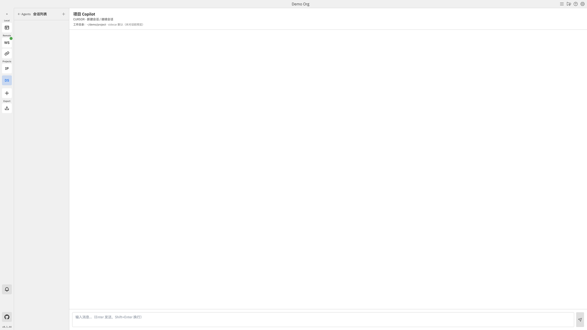

### 3. [Nuevo] Pipelines Squad (DAG)

Plan → Fork → Implement / Review → Join; crear desde el chat, afinar en el lienzo.

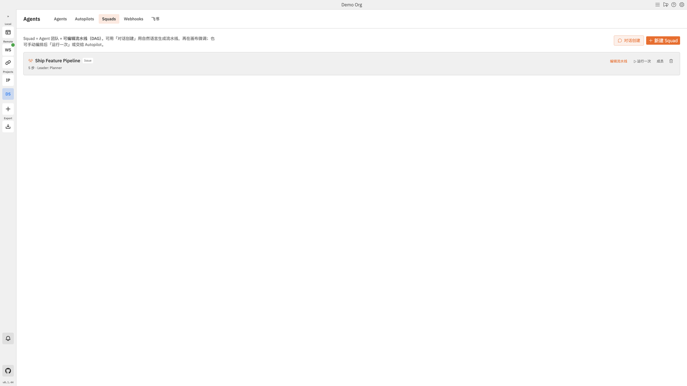

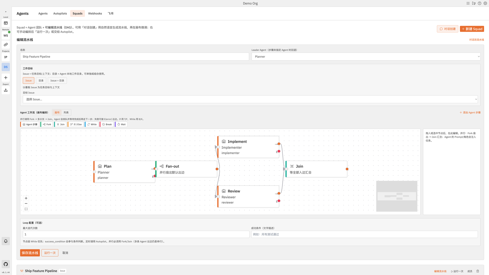

### 4. [Nuevo] Autopilot / Webhooks / Feishu

Tres puntos de entrada extra que todos desembocan en “crear issue → encolar”.

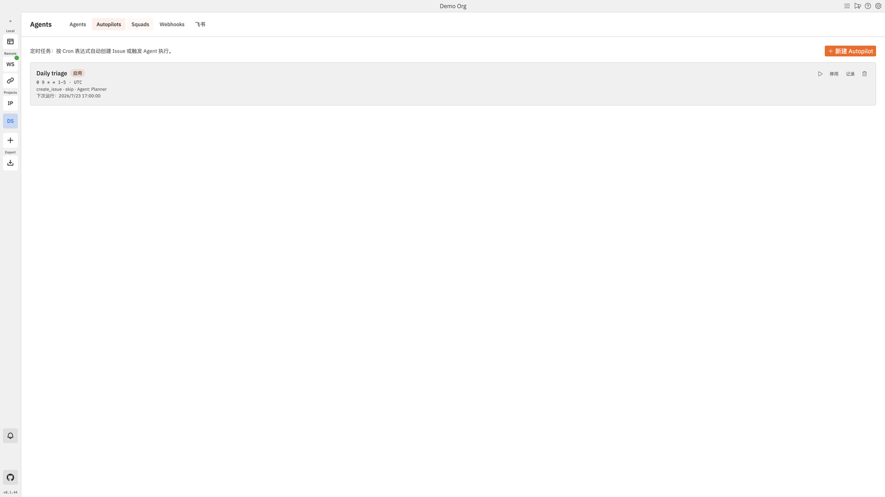

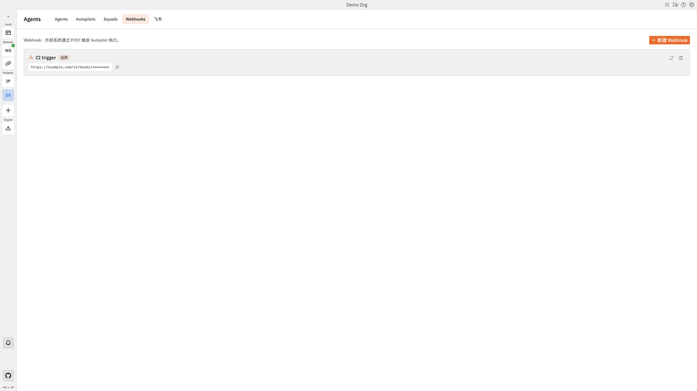

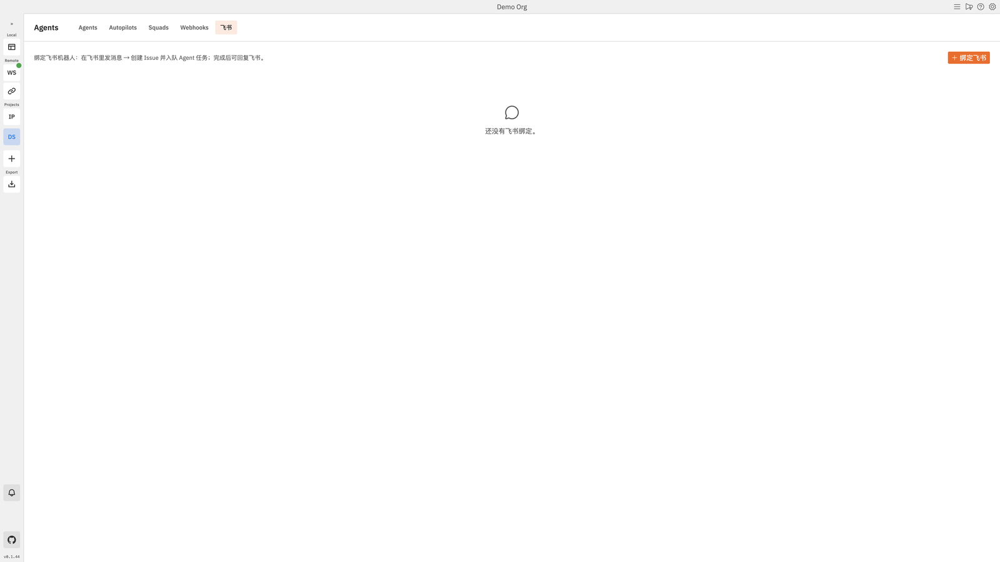

### 5. [Nuevo] Console workspace + host picker

- **Isolated worktree (heredado, por defecto)** — branch / dir dedicados
- **Console (nuevo)** — dir / branch actual; sin branch / commit automáticos
- **Execution host (nuevo)** — esta máquina o un remote worker emparejado

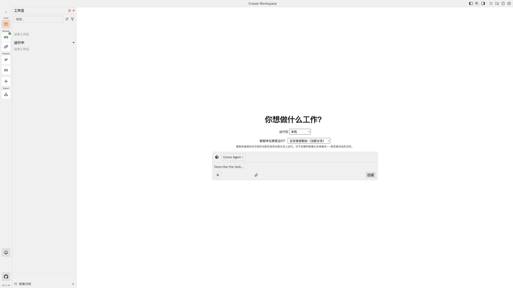

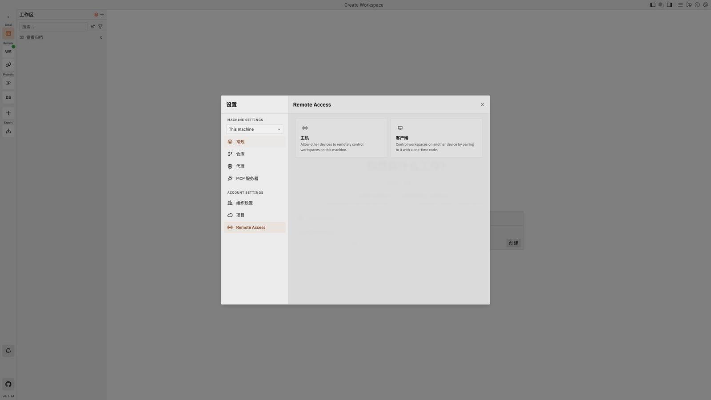

### 6. [Nuevo] Diseño móvil del tablero

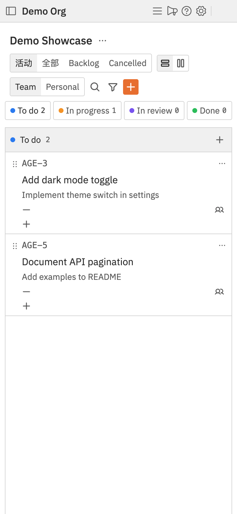

### 7. [Heredado] Workspace sessions / diffs / preview

Núcleo del upstream, conservado y pulido.

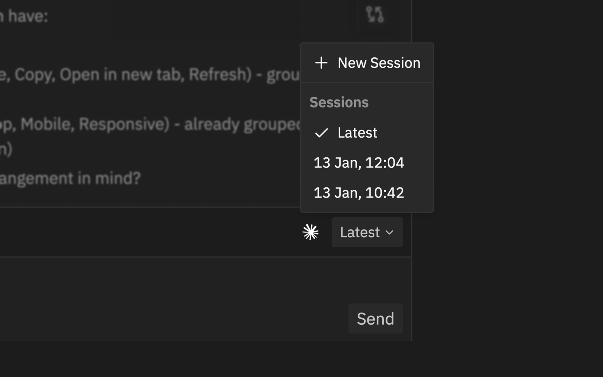

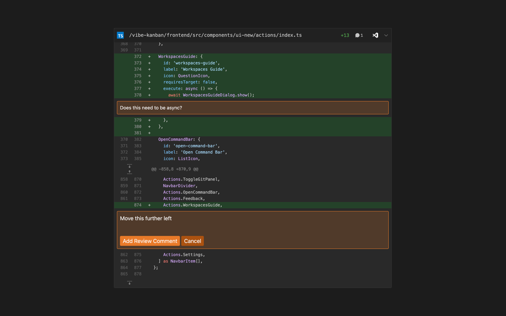

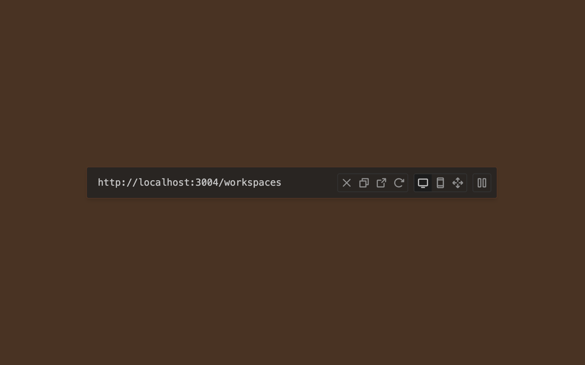

---

## Inicio rápido

Autentícate primero con tu agente de código preferido y luego:

```bash
npx vibe-kanban
```

Eso inicia el servidor local y abre el navegador.

### Remote autoalojado (opcional)

Tras el cierre de la nube oficial, este repo incluye un stack Docker Remote + Relay + ElectricSQL para sincronización multi-dispositivo. Los helpers de desarrollo están en `scripts/vk-*.sh` (puertos en `scripts/vk-ports.sh`). Consulta la [guía de autoalojamiento](docs/self-hosting/deploy-docker.mdx).

---

## Cómo funciona

### Conceptos clave

| Concepto | Qué es |
|---------|------------|
| **Project** | Un proyecto kanban (puede enlazar varios repos git locales) |
| **Issue** | Una tarjeta de tarea en el tablero |
| **Workspace** | Entorno de ejecución: worktree o Console + coding agent |
| **Board Agent** | Rol de chat asignable; la ejecución reutiliza workspaces |
| **Squad** | Pipeline multi-agente + DAG |
| **Host** | Máquina que ejecuta realmente los agentes (local o emparejada) |

### Dos flujos de trabajo

**A. Flujo upstream (heredado, sigue totalmente soportado)**

1. Crear un issue → abrir un Workspace manualmente  
2. Ver logs / Preview → revisar diffs → iterar  
3. Abrir un PR y fusionar  

**B. Flujo de tablero dinámico (nuevo en este fork)**

1. Crear un Board Agent (persona + executor por defecto)  
2. Asignar el issue (o disparar vía @ / webhook / Feishu / Autopilot)  
3. El watcher local encola el trabajo y abre un Workspace  
4. El progreso / los comentarios se escriben de vuelta; opcionalmente aclarar con Copilot  
5. Orquestar trabajo multi-rol con un lienzo Squad  
6. Revisar diffs → abrir un PR (igual que upstream)

---

## Agentes de código compatibles

| Agent | Provider |
|-------|----------|
| Claude Code | Anthropic |
| OpenAI Codex CLI | OpenAI |
| Gemini CLI | Google |
| GitHub Copilot CLI | GitHub |
| Amp | Sourcegraph |
| Cursor Agent CLI | Anysphere |
| OpenCode | SST |
| Factory Droid | Factory AI |
| Claude Code Router (CCR) | Community |
| Qwen Code | Alibaba |
| Pi | Pi (**añadido en este fork**) |

Consulta [supported coding agents](docs/supported-coding-agents.mdx). Los runtimes de chat del tablero (Copilot / agent chat) son una capa aparte de estos ejecutores de código — chat/orquestación es nuevo en este fork; los ejecutores de código son la capa de ejecución del upstream.

---

## MCP Server

```bash
npx vibe-kanban --mcp
```

```json
{
  "mcpServers": {
    "vibe_kanban": {
      "command": "npx",
      "args": ["-y", "vibe-kanban@latest", "--mcp"]
    }
  }
}
```

## Referencia CLI

```bash
npx vibe-kanban               # Local UI
npx vibe-kanban --mcp         # MCP stdio
npx vibe-kanban review        # Review CLI
npx vibe-kanban --help
```

## Documentación

- [`docs/`](docs/) — docs de usuario + autoalojamiento
- [`docs/board-agents-plan.md`](docs/board-agents-plan.md) — diseño de board-agent
- [`docs/remote-access.mdx`](docs/remote-access.mdx) — remote access / pairing

## Soporte y contribución

Usa [Discussions](https://github.com/magele758/hyper-vibekanban/discussions) para ideas e [Issues](https://github.com/magele758/hyper-vibekanban/issues) para bugs. Abre una Discussion antes de PRs grandes.

---

## Desarrollo

### Requisitos previos

- [Rust](https://rustup.rs/) (última stable)
- [Node.js](https://nodejs.org/) (≥ 20)
- [pnpm](https://pnpm.io/) (≥ 8)

```bash
cargo install cargo-watch
cargo install sqlx-cli
pnpm i
```

### Servidor de desarrollo

```bash
pnpm run dev
```

Inicia el backend Rust (`cargo-watch`) y Vite. En la primera ejecución se copia una SQLite DB vacía desde `dev_assets_seed/`.

Stack local completo (Remote Docker + Relay + Desktop):

```bash
bash scripts/vk-start.sh
bash scripts/vk-status.sh
```

### Compilar el paquete npx desde el código fuente

```bash
./local-build.sh
cd npx-cli && node bin/cli.js
```

### Comprobaciones y tipos

```bash
pnpm run check
pnpm run lint
pnpm run format
pnpm run generate-types   # do not edit shared/types.ts by hand
```

### Variables de entorno comunes

| Variable | Description |
|----------|-------------|
| `FRONTEND_PORT` / `BACKEND_PORT` / `HOST` | Puertos de desarrollo / bind |
| `VK_ALLOWED_ORIGINS` | Origins permitidos detrás de un reverse proxy |
| `VK_SHARED_API_BASE` | Remote API (el servidor debe usar http) |
| `VK_SHARED_RELAY_API_BASE` | Relay API |
| `VK_TUNNEL` | Activar el modo túnel del relay |

Define `VK_ALLOWED_ORIGINS` al usar reverse proxy, o el backend devolverá `403`. La integración de editor Remote SSH está en **Settings → Editor Integration**.
