<p align="center">
  <a href="https://github.com/magele758/hyper-vibekanban">
    <picture>
      <source srcset="packages/public/vibe-kanban-logo-dark.svg" media="(prefers-color-scheme: dark)">
      <source srcset="packages/public/vibe-kanban-logo.svg" media="(prefers-color-scheme: light)">
      
    </picture>
  </a>
</p>

<p align="center">Get 10X more out of Claude Code, Gemini CLI, Codex, Cursor, Pi and other coding agents...</p>
<p align="center">
  <a href="https://www.npmjs.com/package/vibe-kanban"></a>
  <a href="https://github.com/magele758/hyper-vibekanban/blob/main/.github/workflows/publish.yml"></a>
</p>

<p align="center">
  <a href="README.zh-Hans.md">简体中文</a> |
  <a href="README.zh-Hant.md">繁體中文</a> |
  <a href="README.ja.md">日本語</a> |
  <a href="README.ko.md">한국어</a> |
  <a href="README.es.md">Español</a> |
  <a href="README.fr.md">Français</a>
</p>

> **Note:** The official Vibe Kanban cloud has been discontinued. This repo is a fork of [BloopAI/vibe-kanban](https://github.com/BloopAI/vibe-kanban) (hyper-vibekanban): **all upstream capabilities are kept**, plus a new **dynamic board-agent** layer and self-hosted Remote.

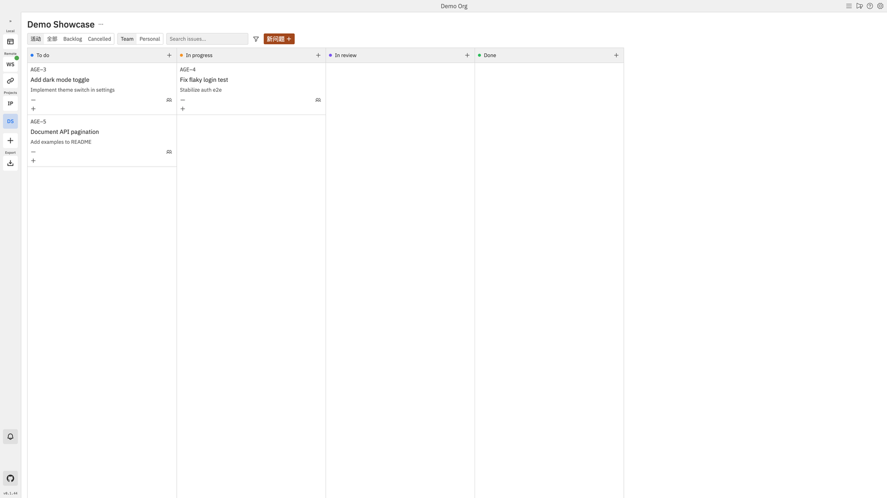

## vs upstream: what we keep / what we add

Upstream is a strong “manually open a Workspace” agent workbench + kanban. This fork keeps that intact, and adds **board event → auto enqueue → execute → write-back**, plus a self-hosted replacement for the retired cloud.

### ✅ Inherited from upstream (fully kept)

| Capability | What it is |
|------------|------------|
| **Kanban issues** | Create / priority / tags / sub-issues / Team·Personal |
| **Workspace + git worktree** | Pick an agent, isolated worktree, live log stream |
| **Sessions & follow-ups** | Multi-session chat, attachments, @-files |
| **Inline diff review** | Unified / side-by-side; comments go back to the agent |
| **App preview** | Built-in browser, DevTools, inspect, device emulation |
| **Coding agents** | Claude Code, Codex, Gemini, Copilot, Amp, Cursor, OpenCode, Droid, CCR, Qwen, Grok |
| **Git / PRs** | Rebase, conflict UX, AI PR descriptions, GitHub / Azure merge |
| **MCP + Review CLI** | `npx vibe-kanban --mcp` / `review` |
| **Settings** | Agent profiles, MCP, editor integration, notifications, org / projects |

Classic path still works: **issue → open Workspace by hand → logs → review diff → PR**.

### ✨ Added in this fork (not in upstream)

| Capability | What it is |
|------------|------------|
| **Board Agents** | Agents are first-class on the board; **assign → enqueue**; local watcher opens a Workspace and writes progress / comments back |
| **Project Copilot** | Board-side chat (default Cursor SDK) to clarify work and suggest assignments — **not** the coding executor that edits files |
| **Squad DAG** | Multi-agent pipelines: Fork / Join / If / While; canvas editor; optional chat-to-pipeline |
| **Autopilot** | Cron + timezone; create issues or run an agent / squad; concurrency skip / queue |
| **Webhooks** | External POST → create issue / enqueue work |
| **Feishu bot** | Feishu message → issue queue; optional reply when done |
| **Console workspaces** | Run in the repo’s **current dir / branch** without forcing a new worktree |
| **Host picker on create** | Run a workspace on this machine or a paired remote worker |
| **Mobile board layout** | Single-column + status pills for phones |
| **Pi coding agent** | Pi CLI as an additional Workspace executor |
| **Self-hosted Remote stack** | Docker Remote + Relay + ElectricSQL after cloud shutdown (`scripts/vk-*.sh`) |

### 🔄 Enhanced vs upstream

| Area | Upstream | This fork |
|------|----------|-----------|
| Remote Access | Official cloud pairing | **Self-hosted** Remote / Relay; worker-host SOP |
| Board | Static cards + manual Workspace | **Assignable agents / squads** with progress write-back |
| Triggers | UI / MCP create Workspace | Also: assign, @, Autopilot, webhook, Feishu |

---

## Feature showcase

Demo data only (Demo Org / Demo Showcase). Marked **[New]** / **[Inherited]**.

### 1. [New] Dynamic board + Board Agents

Assign an agent on the board; execution is enqueued automatically and written back.


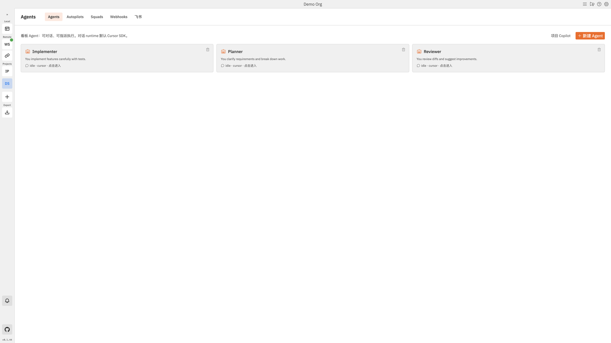

### 2. [New] Project Copilot

Chat/orchestration layer for clarifying work; coding still happens in Workspace executors.

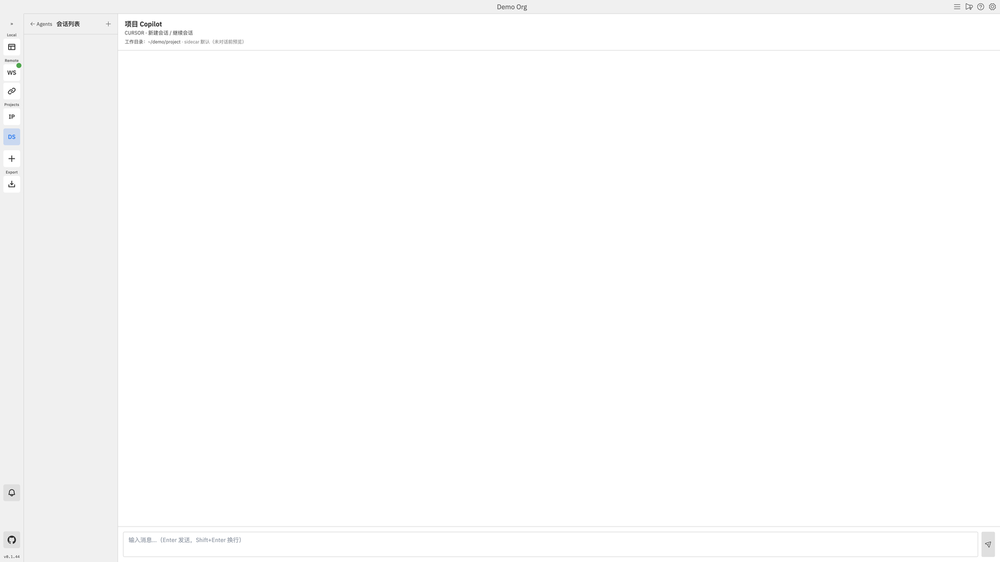

### 3. [New] Squad pipelines (DAG)

Plan → Fork → Implement / Review → Join; create from chat, fine-tune on the canvas.

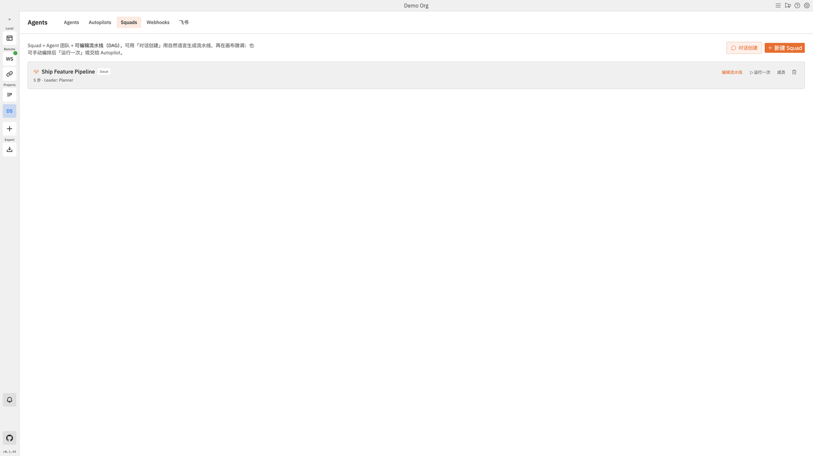

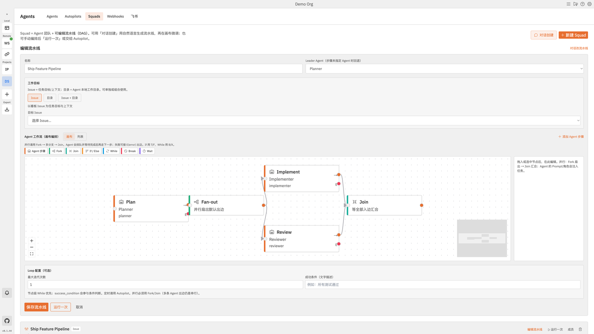

### 4. [New] Autopilot / Webhooks / Feishu

Three extra entry points that all land on “create issue → enqueue”.

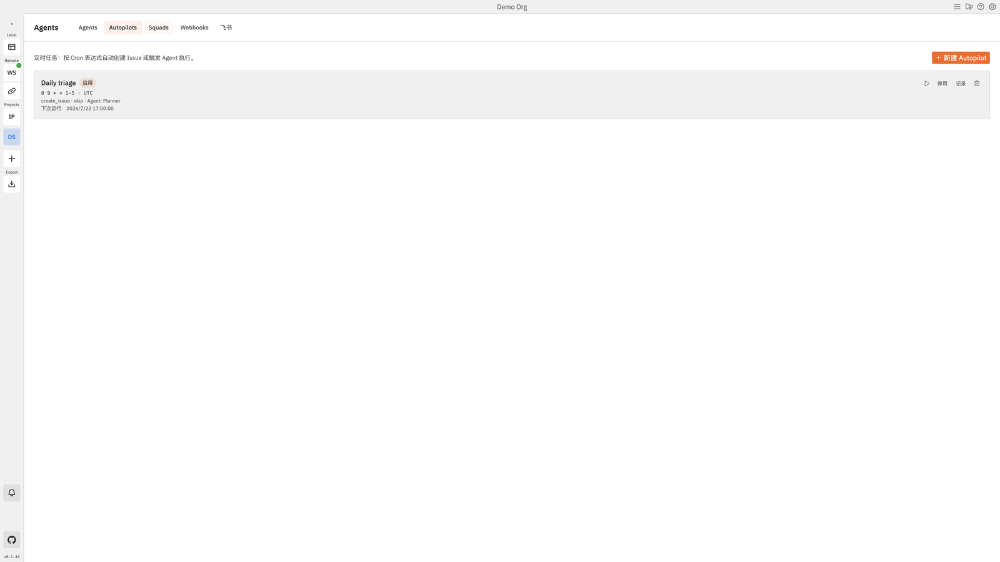

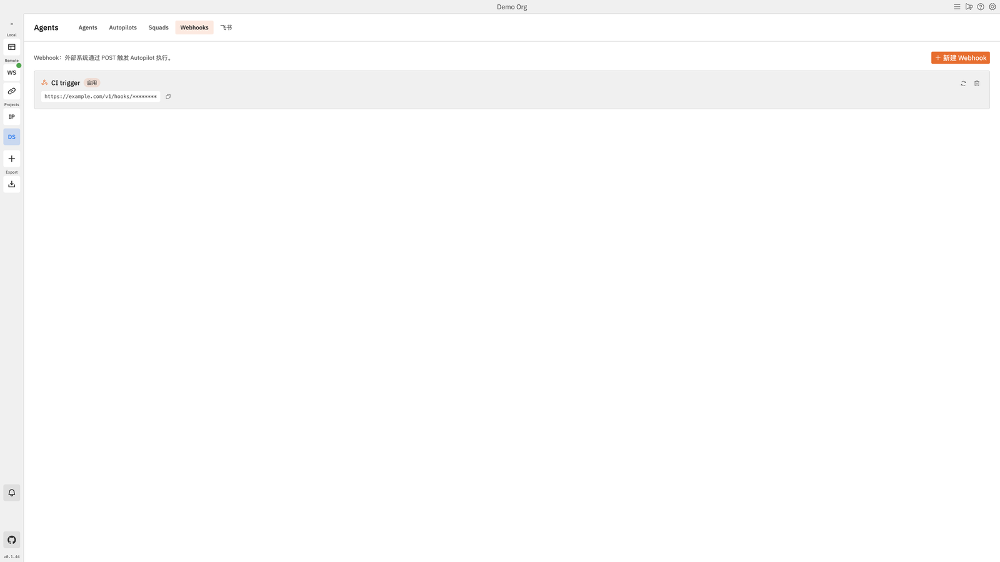

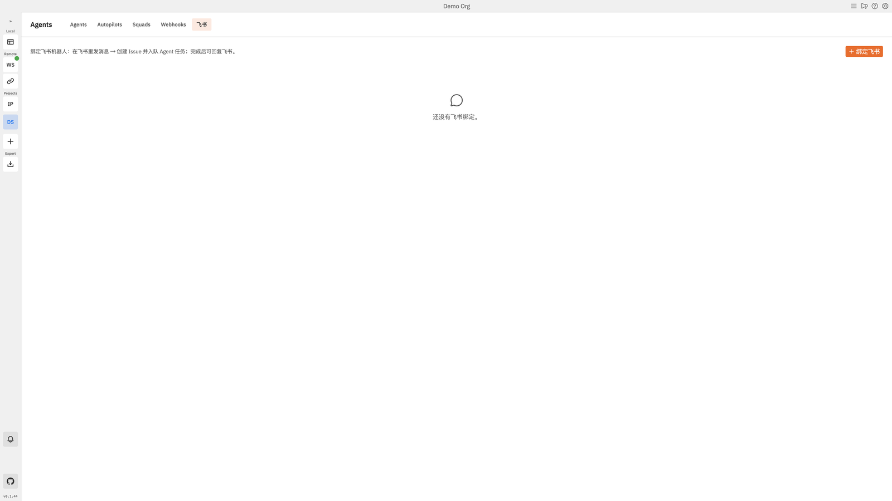

### 5. [New] Console workspace + host picker

- **Isolated worktree (inherited, default)** — dedicated branch / dir
- **Console (new)** — current dir / branch; no auto branch / commit
- **Execution host (new)** — this machine or a paired remote worker

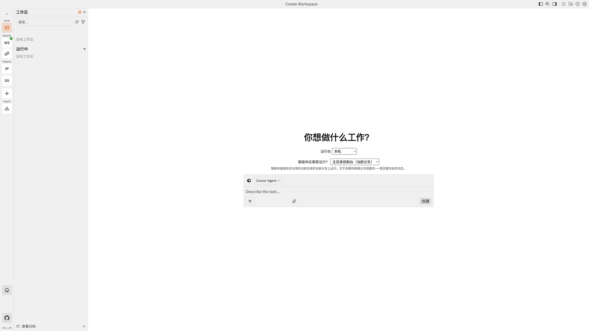

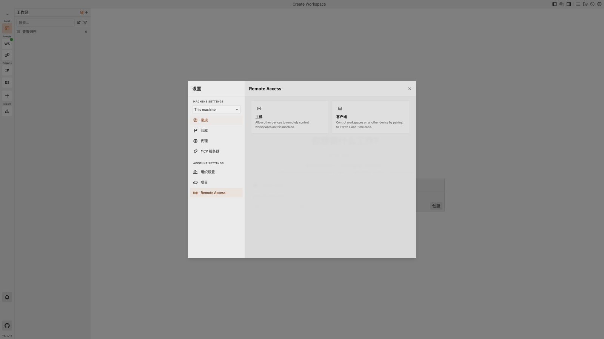

### 6. [New] Mobile board layout

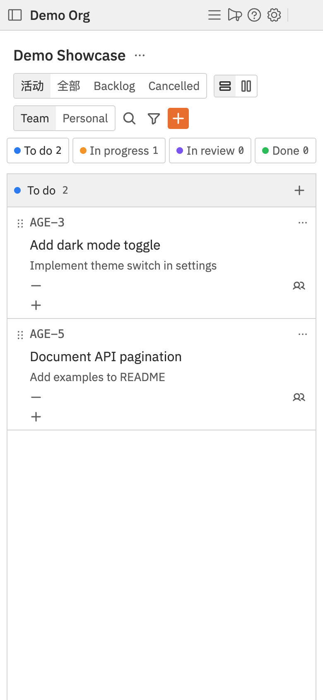

### 7. [Inherited] Workspace sessions / diffs / preview

Upstream core, kept and polished.

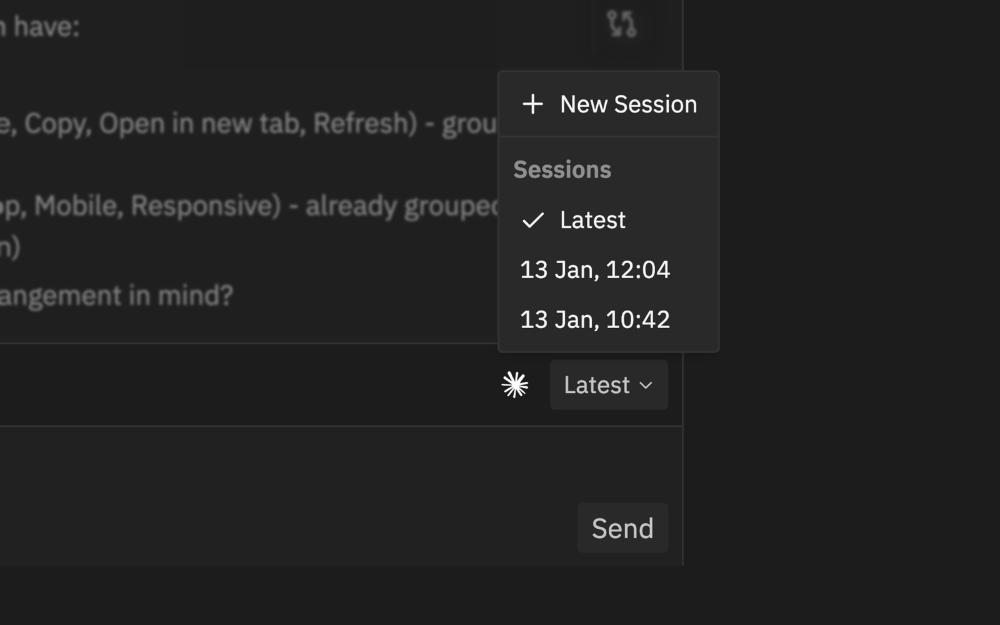

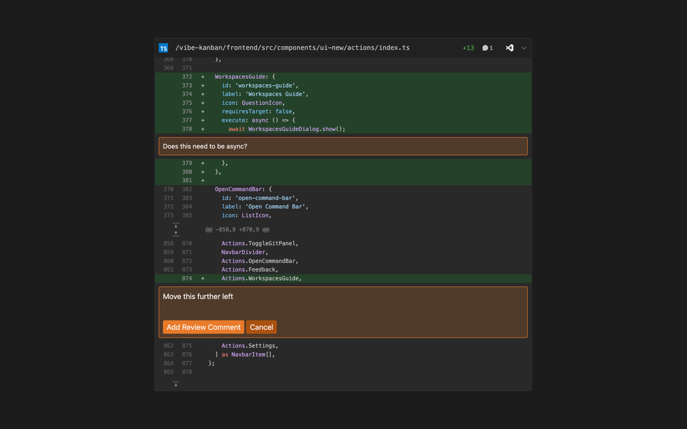

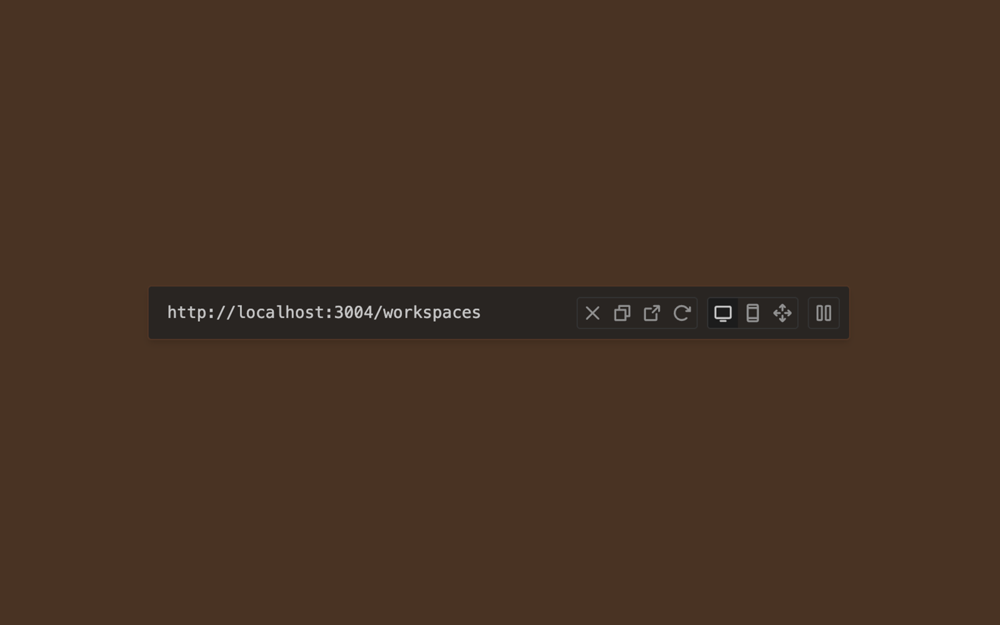

---

## Quick Start

Authenticate with your preferred coding agent first, then:

```bash
npx vibe-kanban
```

That starts the local server and opens your browser.

### Self-hosted Remote (optional)

After the official cloud shutdown, this repo ships a Docker Remote + Relay + ElectricSQL stack for multi-device sync. Dev helpers live under `scripts/vk-*.sh` (ports in `scripts/vk-ports.sh`). See the [self-hosting guide](docs/self-hosting/deploy-docker.mdx).

#### Prebuilt images (GHCR) — deploy without local compiles

CI publishes **multi-arch** (`linux/amd64` + `linux/arm64`) images to GitHub Container Registry on every push to `main`, so servers can **pull instead of compile** (no giant local `target/` cache):

- `ghcr.io/magele758/hyper-vibekanban-remote` — Remote server
- `ghcr.io/magele758/hyper-vibekanban-relay` — Relay server

Deploy by pulling the images (from `crates/remote/`, with your `.env.remote` set):

```bash
export REMOTE_IMAGE=ghcr.io/magele758/hyper-vibekanban-remote:latest
export RELAY_IMAGE=ghcr.io/magele758/hyper-vibekanban-relay:latest
docker compose --env-file .env.remote --profile relay pull remote-server relay-server
docker compose --env-file .env.remote --profile relay up -d   # no --build
```

Upgrading is just `pull` + `up -d`: the server auto-runs DB migrations on start, and your data lives in the named Postgres volume (`remote_remote-db-data`), independent of the image — **it is preserved across image updates**. Keep the same compose project (run from `crates/remote/`) so the volume re-attaches, and never use `-v` (e.g. `docker compose down -v`, `pnpm run remote:dev:clean`, or `pnpm run remote:dev` which runs `down -v` on exit) unless you intend to wipe the database. `docker compose stop` / `pnpm run remote:down` are the safe stop commands. `latest` tracks `main`; pin a specific `sha-<short>` tag for reproducible deploys.

---

## How It Works

### Core concepts

| Concept | What it is |
|---------|------------|
| **Project** | A kanban project (can link multiple local git repos) |
| **Issue** | A task card on the board |
| **Workspace** | Execution env: worktree or Console + coding agent |
| **Board Agent** | Assignable chat role; execution reuses workspaces |
| **Squad** | Multi-agent + DAG pipeline |
| **Host** | Machine that actually runs agents (local or paired) |

### Two workflows

**A. Upstream flow (inherited, still fully supported)**

1. Create an issue → open a Workspace manually  
2. Watch logs / Preview → review diffs → iterate  
3. Open a PR and merge  

**B. Dynamic board flow (new in this fork)**

1. Create a Board Agent (persona + default executor)  
2. Assign the issue (or trigger via @ / webhook / Feishu / Autopilot)  
3. Local watcher enqueues work and opens a Workspace  
4. Progress / comments write back; optionally clarify with Copilot  
5. Orchestrate multi-role work with a Squad canvas  
6. Review diffs → open a PR (same as upstream)

---

## Supported Coding Agents

| Agent | Provider |
|-------|----------|
| Claude Code | Anthropic |
| OpenAI Codex CLI | OpenAI |
| Gemini CLI | Google |
| GitHub Copilot CLI | GitHub |
| Amp | Sourcegraph |
| Cursor Agent CLI | Anysphere |
| OpenCode | SST |
| Factory Droid | Factory AI |
| Claude Code Router (CCR) | Community |
| Qwen Code | Alibaba |
| Pi | Pi (**added in this fork**) |

See [supported coding agents](docs/supported-coding-agents.mdx). Board chat runtimes (Copilot / agent chat) are a separate layer from these coding executors — chat/orchestration is new in this fork; coding executors are the upstream execution layer.

---

## MCP Server

```bash
npx vibe-kanban --mcp
```

```json
{
  "mcpServers": {
    "vibe_kanban": {
      "command": "npx",
      "args": ["-y", "vibe-kanban@latest", "--mcp"]
    }
  }
}
```

## CLI Reference

```bash
npx vibe-kanban               # Local UI
npx vibe-kanban --mcp         # MCP stdio
npx vibe-kanban review        # Review CLI
npx vibe-kanban --help
```

## Documentation

- [`docs/`](docs/) — user + self-hosting docs
- [`docs/board-agents-plan.md`](docs/board-agents-plan.md) — board-agent design
- [`docs/remote-access.mdx`](docs/remote-access.mdx) — remote access / pairing

## Support & Contributing

Use [Discussions](https://github.com/magele758/hyper-vibekanban/discussions) for ideas and [Issues](https://github.com/magele758/hyper-vibekanban/issues) for bugs. Please open a Discussion before large PRs.

---

## Development

### Prerequisites

- [Rust](https://rustup.rs/) (latest stable)
- [Node.js](https://nodejs.org/) (≥ 20)
- [pnpm](https://pnpm.io/) (≥ 8)

```bash
cargo install cargo-watch
cargo install sqlx-cli
pnpm i
```

### Dev server

Daily local stack (**recommended**): pull GHCR Remote/Relay images and run the prebuilt Desktop binary at `~/.vk-kanban/bin/server` (no `cargo-watch`):

```bash
bash scripts/vk-start.sh
bash scripts/vk-status.sh
```

Use `VK_HOT=1 bash scripts/vk-start.sh` only when editing Desktop Rust. Use `VK_REBUILD=1` only to build Remote/Relay images locally.

Source-only hot reload (no Docker):

```bash
pnpm run dev
```

This starts `cargo-watch` + Vite and copies a blank SQLite DB from `dev_assets_seed/` on first run. Do not use this for the daily main stack — it rebuilds tens of GB of `target/`.

### Build npx package from source

```bash
./local-build.sh
cd npx-cli && node bin/cli.js
```

### Checks & types

```bash
pnpm run check
pnpm run lint
pnpm run format
pnpm run generate-types   # do not edit shared/types.ts by hand
```

### Common environment variables

| Variable | Description |
|----------|-------------|
| `FRONTEND_PORT` / `BACKEND_PORT` / `HOST` | Dev ports / bind |
| `VK_ALLOWED_ORIGINS` | Allowed origins behind a reverse proxy |
| `VK_SHARED_API_BASE` | Remote API (server should use http) |
| `VK_SHARED_RELAY_API_BASE` | Relay API |
| `VK_TUNNEL` | Enable relay tunnel mode |

Set `VK_ALLOWED_ORIGINS` when reverse-proxying, or the backend returns `403`. Remote SSH editor integration is under **Settings → Editor Integration**.
