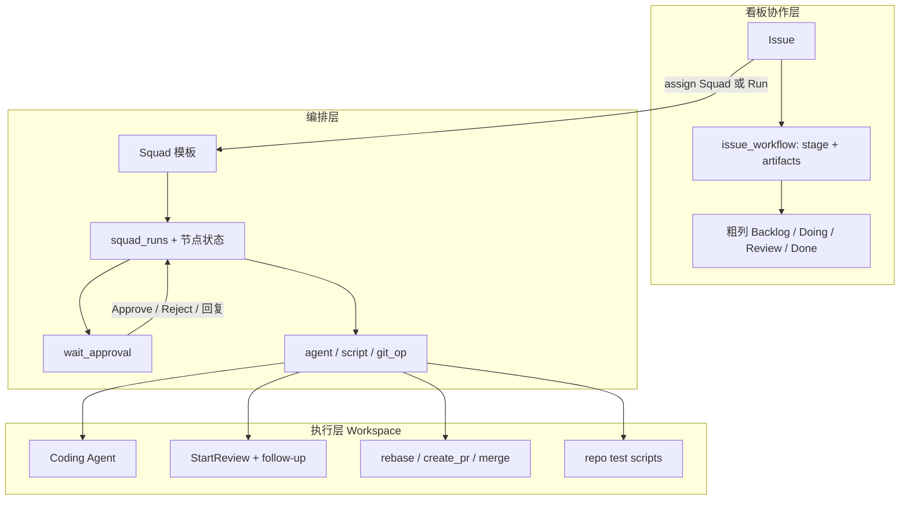
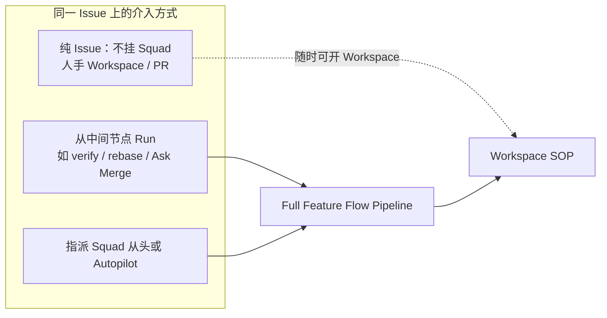
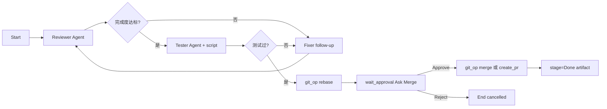

# AI 工作流主骨（Stage Protocol）与 Feature Autopilot

> 状态：方案定稿，**Batch 1 已落地代码**（待本机 `VK_REBUILD` 跑 migration 验证）  
> 关联：[board-agents-plan.md](./board-agents-plan.md)（Board Agent / Squad 已落地骨架）  
> 更新：2026-07-15

把「想法 → 方案 → 实现 → 验证 → 合并 → 发布」做成 vibe-kanban 的一等编排能力；首个可演示 case 是 **Feature Autopilot（Closeout）**：挂 Squad 后自动 review / 测试 / rebase，并在合并前询问人。

**产品硬约束（2026-07-15 补齐）：**

1. **保留纯 Issue 开发模式**——不挂 Squad / 不跑 pipeline 时，行为与今日完全一致（人手开 Workspace、follow-up、rebase、PR）。
2. **一条大 Pipeline 覆盖全流程**，但**任意中间节点都可切入**——不是只能从头跑；Closeout / 只测 / 只合并都是「从某节点起跑到结束」。
3. **前端交互是一等设计**——Issue 面板、Squad 编辑器、Inbox 门禁、Run 对话框都有明确入口（见 §2.3 / §7.3）。

---

## 0. 一句话定位

| 层 | 职责 | 今天 | 本方案补什么 |
|----|------|------|----------------|
| 看板列 | 粗粒度协作状态 | 默认 6 列，可自定义 | **不**改成 9 列状态机；只做粗映射 |
| Stage Protocol | Feature 生命周期语义 | 无 | Issue 上的 `stage` + `artifacts` |
| Squad Pipeline | 多角色编排 | 有 DAG；指派只跑 leader；`wait`=sleep | 指派可跑全 pipeline；`wait_approval`；`git_op` / `script` |
| Workspace SOP | 真正改代码 / git / PR | 完整 | 被编排层调用，不替换 |

**缺的不是再多一个 coding agent，而是：阶段契约 + 人机门禁 + 自动把现有 git/review/test 串起来。**

---

## 1. 用户心智模型（9 段 → 产品落点）

| # | 用户阶段 | Stage id | 主产出 artifact | 人介入 |
|---|----------|----------|-----------------|--------|
| 1 | 想法、调研、讨论、确认方案 | `ideate` | `proposal` | **确认方案** |
| 2 | 详细架构、影响范围、选型 | `design` | `design`, `impact` | **选型确认**（小改可跳过） |
| 3 | 修改方案 / 影响范围 | 回环 `ideate`/`design` | 更新上述 | 人改需求 |
| 4a | MVP | `implement_mvp` | `mvp_diff` | 可选看 progress |
| 4b | 完整版 | `implement_full` | `full_diff` | 可选 |
| 5 | 测试：新功能 / 旧核心 / 交叉 | `verify` | `test_report` | 失败多轮问答 |
| 6 | 补全 + 再测 | `extend` | `extend_diff`, 更新 `test_report` | 同上 |
| 7 | 整体回归 | `regress` | `regression_report` | 失败门禁 |
| 8 | 合并主干 | `merge` | `pr` / `merge_result` | **Ask Merge** |
| 9 | 多环境 / release 包 | `release` | `release_notes` | **是否发版** |

原则：

1. **阶段推进靠编排 + artifact 验收，不靠拖列。**
2. 列只反映「想法 / 在做 / 等人 / 完」。
3. 合并与发版默认**必须人批**（安全默认）。

---

## 2. 架构总览



### 2.1 与现有 SOP 的关系（同一 Issue，三种用法）

三种用法落在**同一条大 Pipeline 模板**上，差异只是「起跑点」和「是否自动编排」——**不是三套产品**。



| 模式 | 怎么进 | Pipeline | Workspace |
|------|--------|----------|-----------|
| **纯 Issue** | 不指派 Squad；或指派了人也只当协作者 | 不跑 | 人手开 / 跟今日一样 |
| **中段切入** | Issue / Squad 页「从该步骤运行」 | 从选中节点起跑到汇合/结束；上游视为已由人完成 | 可已有 worktree |
| **全自动** | 指派 `on_assign=full_pipeline` 的 Squad，或 Autopilot | 从头（或配置的默认入口） | 编排层开 |

硬规则：

- 挂了 Squad **不禁止**人手开 Workspace、拖列、手点 merge——编排是加速层，不是锁死态。
- 取消指派 / 取消 run → 回到纯 Issue，无残留强制状态机。
- `on_assign` 默认仍为 `leader_only`（兼容旧 Squad）；模板 Closeout / Full Flow 才用 `full_pipeline`。

### 2.2 任意节点切入（`start_from_node_id`）

一条大 DAG 始终存在；运行时可选入口：

```text
POST /v1/squads/{id}/run
{
  "issue_id": "...",
  "start_from_node_id": "n_verify",   // 可选；缺省 = 拓扑根
  "working_directory": "..."
}
```

语义：

1. 以 `start_from_node_id` 为**唯一根**开始 walk（其上游节点**不执行**，记 `skipped_upstream`）。
2. 从该节点出发的出边、while/fork/join 语义不变。
3. UI 场景映射（同一模板）：

| 用户场景 | 建议入口节点 |
|----------|----------------|
| 只有想法，要全自动 | 根：`ideate` / Research |
| 方案已定，只要人写代码 | `implement_mvp` |
| 代码写完，只要收尾 | Closeout 的 `review`（或独立 Closeout Squad） |
| 只要回归 | `regress` script |
| 只要问能不能合 | `ask_merge`（`wait_approval`） |

节点可标 `stage` / `entry_label`（展示用），便于 Issue 上「快捷入口」按钮，而不强迫用户认 node id。

Resume（门禁通过后）= 再次 `run`，`start_from_node_id` = 门禁节点的 default 出边目标。

### 2.3 前端交互（产品规格）

#### A. Issue 面板（Kanban 右侧）

| 区块 | 行为 |
|------|------|
| **开发（保留）** | 现有：开 Workspace、关联 PR、Agent 任务列表——纯 Issue 主路径，位置与今日一致 |
| **工作流条** | 有 `issue_workflow` 或活跃 `squad_run` 时显示：当前 stage + 节点进度点；无则隐藏（不打扰纯 Issue） |
| **快捷运行** | 若项目有 Full Flow / Closeout 模板：下拉「从…开始」→ 选入口（按 `entry_label`）→ `run` 带 `start_from_node_id` |
| **待审批** | run=`waiting_approval` 时置顶 Approve / Reject / 回复；与 Inbox 同源 |
| **Artifacts** | 折叠区列出 proposal / test_report 等（Batch 3）；Batch 1 可用评论摘要代替 |

#### B. Squad 编辑器（Agents 页）

| 控件 | 行为 |
|------|------|
| 画布节点 | 现有 + `wait_approval` / `script` / `git_op` 进 palette |
| 节点属性 | approval 文案、script 命令、git op、**entry_label**、绑定 **stage** |
| `on_assign` | 下拉：仅 Leader / 跑全 Pipeline |
| **运行** | 对话框：选 Issue + **从哪一步开始**（节点列表）+ 可选 path → 调 run API |
| 画布右键节点 | 「从此处运行」（同 run + start_from） |

#### C. Inbox

- `type=workflow_approval`：标题含 Issue 标识 + 门禁种类（确认方案 / Ask Merge…）
- 操作：Approve / Reject；Reject 可带 comment；跳转 Issue

#### D. 看板卡片

- 有活跃 pipeline run：小徽章「流水线中 / 待你批准」（复用 agent_task 徽章思路）
- 无 run：无新 UI（纯 Issue 零噪音）

#### E. 不改的交互

- 创建 Issue、拖列、评论、@Agent、人手 Create Workspace、diff review、手动 rebase/PR——全部保留。

---

## 3. Stage Protocol（数据模型）

### 3.1 存储

新增表（或 `issues` JSON 列，推荐独立表便于 shape / inbox）：

```text
issue_workflow
  issue_id          PK FK
  current_stage     text   -- ideate | design | implement_mvp | ...
  stage_updated_at  timestamptz
  config            jsonb  -- 跳过哪些门禁、模板 id
  created_at / updated_at

issue_artifacts
  id                uuid PK
  issue_id          FK
  kind              text   -- proposal | design | impact | mvp_diff | ...
  stage             text
  body_md           text   -- 人可读摘要（评论也可引用）
  payload           jsonb  -- 结构化：checklist、命令退出码、PR url 等
  produced_by       text   -- agent_task_id / squad_run_id / user
  created_at
```

可选：`issue_workflow_events` 审计（stage 变更、门禁结果），首期可用评论 + Inbox 代替。

### 3.2 粗列映射（默认模板）

| current_stage | 建议列名（按名匹配，同今日 PR 逻辑） |
|---------------|--------------------------------------|
| `ideate`, `design` | Backlog 或 To do |
| `implement_*`, `extend` | In progress |
| `verify`, `regress`, `merge`（待批） | In review |
| merge 完成 / `release` 完成 | Done |

人手拖列仍允许；编排层以 **stage + artifact** 为准，列同步失败不阻断流水线。

### 3.3 Artifact 验收契约（节点成功条件）

| kind | 最低合格标准 |
|------|----------------|
| `proposal` | 含目标、非目标、验收标准；门禁 Approve |
| `design` | 含模块边界、影响范围、选型结论 |
| `impact` | 含触及文件/API/迁移风险列表 |
| `test_report` | checklist 三项均 pass（见 §5.3） |
| `regression_report` | 约定回归命令 exit 0 |
| `pr` | 已创建 PR 且 CI 状态可读（可读则记录） |
| `merge_result` | 已 merge 或明确记录「用户拒绝」 |

Agent 节点结束时：watcher / pipeline runner 解析评论或约定 JSON 块写入 `issue_artifacts`；过不了契约则走 `while` / `error` 边，而不是默默推进 stage。

---

## 4. Squad 编排升级

### 4.1 今日缺口

| 行为 | 今天 | 目标 |
|------|------|------|
| 指派 Squad | 只 enqueue `leader`（`is_leader_task`） | Squad 配置 `on_assign: leader_only \| full_pipeline` |
| `wait` | `wait_seconds` sleep | 保留 sleep；新增 **`wait_approval`** |
| git / PR | 仅 Workspace UI/API，人手点 | **`git_op` 节点**调用同一 API |
| 测试 | Agent 自觉跑或人手 | **`script` 节点**跑 repo 脚本 |
| 跑记录 | `RunSquadResponse` 瞬时 | 持久化 **`squad_runs` / `squad_run_nodes`** |
| 入口 | 只能从头 / 手点 Run | **`start_from_node_id`**：任意节点切入；上游 skipped |

### 4.2 节点类型扩展

```text
现有: agent | if | while | break | wait | fork | join
新增: wait_approval | script | git_op
```

#### `wait_approval`

```json
{
  "type": "wait_approval",
  "label": "Ask Merge",
  "approval_kind": "merge",
  "prompt_template": "实现与测试已完成，是否合并到 {{target_branch}}？\n\n摘要：{{summary}}\nPR：{{pr_url}}",
  "timeout_hours": 72,
  "on_timeout": "cancel"
}
```

行为：

1. 写 Issue 评论 + Inbox（`type=workflow_approval`）。
2. pipeline run 进入 `waiting_approval`；占用节点不继续。
3. 用户在评论按钮 / Inbox / API：`approve` | `reject` | `comment`（comment 可带回 while 环）。
4. `approve` → 走 default 出边；`reject` → `false`/`error` 边。

这是复刻「多问几轮发现问题」的**产品门禁**，与 executor 工具 Approval 不是同一概念。

#### `script`

```json
{
  "type": "script",
  "label": "Run verify suite",
  "script_key": "verify",
  "command": "pnpm run check && pnpm run lint",
  "cwd_from": "workspace",
  "artifact_kind": "test_report"
}
```

在关联 Workspace（或 `working_directory`）执行；stdout/stderr 截断入库；非 0 → `error` 边。

#### `git_op`

```json
{
  "type": "git_op",
  "op": "rebase | create_pr | merge | push",
  "target_branch": "main",
  "on_conflict": "pause_approval"
}
```

调用 Local API 现有：

- `POST /api/workspaces/{id}/git/rebase*`
- `POST /api/workspaces/{id}/pull-requests`
- merge workspace API

冲突 → 自动转 `wait_approval`（「冲突需处理」）或 `error` 边指派 Fixer Agent（模板可配）。

### 4.3 指派即跑全 pipeline

`squads` 增加：

```text
on_assign: 'leader_only' | 'full_pipeline'   -- 默认 leader_only 保持兼容
```

Assignee 写入 `squad_id` 且 `on_assign=full_pipeline` 时：

1. 创建 `squad_runs`（status=`running`）。
2. 后台调用与 `POST /v1/squads/{id}/run` 相同的 `execute_squad_pipeline`（**不阻塞**指派 API）。
3. 不再只 enqueue leader（除非模板显式第一个节点就是 leader 规划步）。

`on_assign=leader_only`（默认）：保持今日行为——只 enqueue leader，**纯 Issue + Leader 参谋**场景不受影响。

Autopilot 已支持 `squad_id`；与之对齐即可。

### 4.3b 节点展示字段（切入友好）

`SquadPipelineNode` 增加可选：

```text
entry_label?: string   -- UI「从…开始」显示名，如「测试验证」「Ask Merge」
stage?: string         -- 对齐 Stage Protocol id（ideate/verify/merge…）
```

无 `entry_label` 的节点仍可在高级列表里选 id，但不进 Issue 快捷入口。

### 4.4 持久化 run（建议）

```text
squad_runs
  id, squad_id, issue_id, status
  -- queued|running|waiting_approval|completed|failed|cancelled
  current_node_id, started_at, completed_at, error_message

squad_run_nodes
  run_id, node_id, status, agent_task_id, started_at, finished_at
  output_summary, artifact_id
```

UI：Issue 面板展示「流水线进度」；Inbox 挂 run_id 便于一键 Approve。

---

## 5. 首个具体 Case：Feature Autopilot（Closeout）

### 5.1 用户故事

> 我给正在开发的 Feature Issue 挂上 **Feature Closeout** Squad。  
> 之后我不盯执行日志；系统自动 review（不够就多轮追问/回修）、跑测试、rebase，最后问我是否合并。  
> 我只在完成度问答和 Ask Merge 时点几下。

入口时机（MVP 先支持其一，推荐 A）：

- **A.** 实现已有 Workspace/diff 后，指派 Closeout（从 review 开始）。
- **B.** 从 To do 指派 Full Flow（含 implement）；Closeout 作为后半段子图。

### 5.2 Pipeline 拓扑（Closeout）



角色 Agent（项目模板预置）：

| Agent | instructions 要点 |
|-------|-------------------|
| Reviewer | 对照 Issue 验收标准与 diff；输出缺口清单；不够则明确「需回修」 |
| Tester | 按 §5.3 checklist 设计/执行验证；写 `test_report` |
| Fixer | 只修 Reviewer/Tester 指出的点；禁止扩 scope |
| Closer | leader；汇总摘要、触发 git_op / 门禁文案（可与 Reviewer 合并为少角色） |

MVP 可压成 **3 个 Agent**：Reviewer / Tester / Implementer(Fixer)，Closer 逻辑放在 pipeline 节点 prompt。

### 5.3 测试 checklist（写入 Tester prompt + artifact）

1. **新功能**：Issue 验收标准逐条验证（命令或手工步骤列表）。
2. **旧核心**：项目约定的 smoke（如 `pnpm run check` / 关键单测）。
3. **交叉**：与邻接模块的接口/权限/迁移风险（来自 `impact` artifact；若无则先补一轮轻量 impact）。

未三项 pass → 不得进入 rebase。

### 5.4 门禁文案（Ask Merge）

```text
【Ask Merge】{{issue_identifier}} {{title}}

完成度：Review {{n}} 轮后通过
测试：新功能 ✅ / 旧核心 ✅ / 交叉 ✅
Rebase：已对齐 {{target_branch}}（或：有冲突已暂停）
PR：{{pr_url 或「将直接 merge workspace」}}

请选择：
- Approve — 合并 / 保留 PR 待你在 GitHub 合
- Reject — 流水线停止，Issue 留在 In review
- 回复说明 — 回到 Fixer 再改一轮
```

默认：**Approve 才 merge**；模板可改成「只建 PR、不 merge」。

### 5.5 完成度偏差环（复刻「多问几轮」）

```text
while condition = "reviewer_says_needs_work OR test_failed"
  max_iterations = 5
  body → Fixer agent → Reviewer/Tester
  exit → git_op rebase
```

超过 `max_iterations` → `wait_approval`（「自动回修次数用尽，是否继续 / 人手接管」）。

---

## 6. Full Feature Flow（9 段模板，第二批）

在 Closeout 稳定后，同一 Stage Protocol 上挂完整模板：

```text
Copilot/Research Agent
  → wait_approval(确认方案)
  → Architect Agent（design + impact）
  → wait_approval(选型确认，可配置 skip_if_label=small)
  → Implement MVP Agent
  → verify（子集）
  → Implement Full / Extend
  → Feature Closeout 子流程（§5）
  → regress script
  → release wait_approval + script/agent
```

前半段偏**对话与文档 artifact**；后半段偏 **Workspace coding**。不要用对话 runtime 替代 coding executor。

---

## 7. API / UI 改动清单

### 7.1 Remote

| 项 | 说明 |
|----|------|
| `issue_workflow` CRUD + shape | Issue 面板展示 stage |
| `issue_artifacts` list/create | 流水线与 Agent 回写 |
| `squads.on_assign` | 兼容默认 `leader_only` |
| `POST /v1/squads/{id}/run` | 已有；扩展 `start_from_node_id`；指派 full_pipeline 复用 |
| `POST /v1/squad-runs/{id}/approve` | body: `{ decision, comment? }`；通过后从下一节点 resume |
| Inbox type | `workflow_approval` |
| 节点枚举 | 扩展 `SquadPipelineNodeType` + `entry_label`/`stage`；`pnpm run remote:generate-types` |

### 7.2 Local

| 项 | 说明 |
|----|------|
| pipeline runner 调 git/script | Remote 发「执行意图」或 Local watcher 认 `git_op`/`script` task kind |
| 推荐 | 扩展 `agent_tasks` 或并行 `workspace_jobs`：`kind=script\|git_op`，watcher 执行后回写 Remote |

首期实现建议：**Remote 编排状态机 + Local watcher 认新 task kind**，避免 Remote 直连用户机器 git。

### 7.3 UI（与 §2.3 对齐，Batch 1 必做子集）

**Batch 1 必做：**

- Squad 编辑器：palette 增加 `wait_approval`；节点可填 `entry_label` / approval 文案；`on_assign` 开关。
- Run 对话框：选 Issue + **从哪一步开始**（有 entry_label 的节点优先）。
- Issue 面板：活跃 run 进度条 + 待审批 Approve/Reject（可先只读 agent tasks，Batch 1 末加上 run）。
- Inbox：`workflow_approval` 展示与操作。

**Batch 1 明确不做（留给后续，避免吵纯 Issue）：**

- 强制 Stage 条占位；无 run 时 Issue 面板零新增控件。
- 替换「开 Workspace」主按钮。

**Batch 2+：** Closeout 模板一键安装、script/git_op 表单、Artifacts 折叠、看板流水线徽章。

---

## 8. 分期与验收

### Batch 0 — 方案（本文）✅

- Stage 语义、粗列映射、Closeout 故事、非目标。

### Batch 1 — 门禁 + 任意切入 + 指派跑全 pipeline

**验收：**

1. **纯 Issue 不回归**：不指派 Squad / `on_assign=leader_only` 时，行为与改造前一致。
2. Squad `on_assign=full_pipeline`，指派后自动跑多 agent 节点（不必手点 Run）。
3. Run 可带 `start_from_node_id`；上游不执行；UI 能选「从该步骤运行」。
4. `wait_approval` 卡住；Inbox / Issue 可 Approve；通过后从下一节点继续。
5. Issue 上可见 run 进度（有 run 才显示）。

### Batch 2 — Closeout 可演示 — **代码已落地（待 ubuntu1 验证）**

**已实现：**

1. `script` / `git_op` 经 `execution_prompt` JSON 入队；Local `AgentTaskWatcher` 执行（rebase/merge/push/shell）。
2. `POST /v1/projects/{id}/workflow-templates/feature-closeout` + UI「安装 Closeout 模板」。
3. Closeout pipeline：Review → 完成度 if → Fixer 环 → Tester → script check → rebase → Ask Merge。

**验收（在 ubuntu1，勿碰本机 vk-stop/start）：**

1. 安装模板后，对有 Workspace 的 Feature 指派 Closeout 或从「代码审查」切入。
2. Review while / if 环至少能追问/回修 1 轮。
3. `script` 跑通；失败不进入 rebase。
4. `git_op rebase` 成功后出现 Ask Merge。
5. Approve 后可继续（merge 节点可另挂；默认 Ask Merge 为人批终点）。

### Batch 3 — Stage Protocol + Full Flow 前半

- `issue_workflow` / artifacts；方案/架构门禁；与粗列同步。

### Batch 4 — 回归 + Release

- regress / release 节点与门禁；多环境脚本留扩展点，不内建完整 CD。

---

## 9. 非目标（防膨胀）

- 用 9 列替换默认看板。
- 默认自动 merge 进 main（无 Ask Merge）。
- 把 GitHub Actions / 整套 CD 搬进 VK。
- 用 Copilot/对话 runtime 直接替代 Workspace coding executor。
- 打破现有手动 Workspace SOP。

---

## 10. 推荐落地顺序（工程）

1. `wait_approval` + `squad_runs` + approve API + Inbox（不碰 git 也能演示「少盯盘」）。
2. `on_assign=full_pipeline`。
3. Local `script` / `git_op` job + Closeout 模板 JSON。
4. Stage Protocol 表与 UI 条。
5. Full Feature Flow 模板。

---

## 11. 开放配置（模板级，非产品分叉）

| 配置 | 默认 | 说明 |
|------|------|------|
| merge 模式 | `ask_then_merge_workspace` | 或 `ask_then_create_pr_only` |
| Closeout 最大回修轮数 | 5 | while max_iterations |
| 小改跳过 design 门禁 | label `small` | Full Flow 用 |
| 回归命令 | 项目 `scripts.verify` | script_key |

---

## 12. 成功标准（产品）

- 主路径：用户从「有 diff 的 Feature」到「合并完成」，**主动介入次数 ≤ 3**（完成度问答 0～2 次 + Ask Merge 1 次）。
- 失败路径：测试红 / 冲突 / 轮次耗尽时，**一定**落到 Inbox 门禁，而不是静默停在 running。
- 不回归：未挂 Autopilot 的项目，行为与今日 Board Agent / 手动 SOP 一致。
