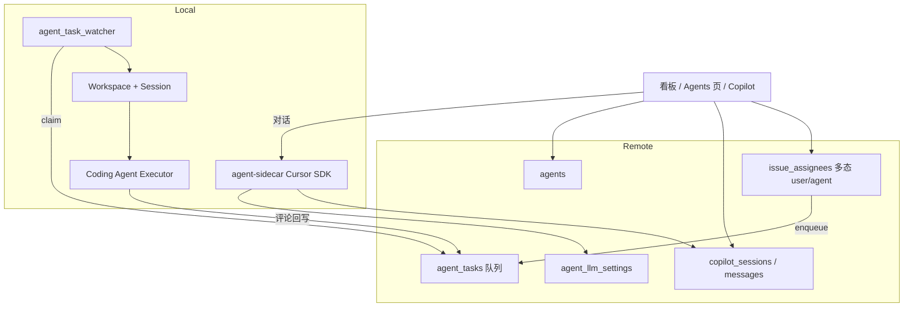

# 看板 Agent（Board Agents）功能规划

> 状态：一二三期 MVP 可用（非严重缺口已补齐；官方 Pi/OpenCode SDK / 专用 IM 仍不做）  
> 关联 Issue：EBE-72（父）、EBE-82 / EBE-83 / EBE-84  
> 延伸：Feature 生命周期守护见 [`feature-babysitter-plan.md`](./feature-babysitter-plan.md)  
> 参考：Multica（https://github.com/multica-ai/multica）、Pi Agent SDK（https://github.com/earendil-works/pi）、Cursor TypeScript SDK  
> 更新：2026-07-14

本文档同时保留：**早期调研对比**、**已拍板产品决策**、**分期落地与实现入口**，避免调研结论只留在对话里。

**MVP 验收口径：** 一期「指派 → 入队 → 执行 → 回写」打通；二/三期 Autopilot / Inbox / 续跑 / Mention / Squad / Webhook / Electric 订阅可用；不以官方 SDK 或专用 IM 冒充完成。

---

## 0. 一句话定位

| 产品 | 定位 |
|------|------|
| **VK（升级前）** | 「人工触发的 Agent 工作台 + 协作看板」——执行层强（worktree / 多 executor / MCP），缺「看板事件 → 自动跑 → 回写」 |
| **Multica** | 「人 / Agent 共用 Issue、指派即执行」的动态看板 |
| **VK（目标）** | 在**不替换**现有 coding executor 的前提下，叠一层编排：可指派 Agent、可对话 Copilot、指派即入队执行并回写 |

缺的不是「再多一个能写代码的 Agent」，而是 **看板事件 → 自动跑 → 结果回写**。Multica 最值钱的也是这一层，不是 cron 本身。

---

## 1. 目标

把「静态看板」升级为「可指派、可对话、可自动执行」的动态看板：

- **看板 Agent**：项目内一等公民（人设 / instructions / 默认 executor / 并发 / LLM 凭证）
- **对话层（Copilot）**：开工前澄清需求、拆任务、写 prompt；可选自然语言整理 Issue
- **执行层**：不另起炉灶，复用现有 Workspace + Coding Agent SOP

原则：**原 SOP 仍是干活引擎；Board Agent 负责「谁干、何时干、带着什么人设干」，并把结果挂回看板。**

---

## 2. 调研对比：VK vs Multica vs Pi

### 2.1 分层对照

| 层 | VK 现状（升级前） | Multica 多出来的 |
|----|------------------|------------------|
| 看板 | Issue / Project / 指派人 | Agent / Squad 一等公民 assignee |
| 触发 | UI / MCP / API **手动**开 Workspace | 指派 / @ / Chat / Autopilot **自动入队** |
| 执行 | 强（worktree + 多 executor） | Daemon claim + session 续跑 + 流式回写 |
| 调度 | 无 | Cron / Webhook / 并发策略 |
| 协作 | 多 Session 并行，编排弱 | Squad Leader 委派协议 |

### 2.2 Multica 值得学习的能力清单（评估用）

#### P0 — 动态看板骨架（没有这些仍是「静态 + 外挂 Agent」）

1. **多态 Assignee**：人 / Agent /（预留）Squad 可被指派、@、出现在评论作者  
2. **Issue → Task 入队谓词**：指派、出 Backlog、状态变更统一决定是否跑 Agent  
3. **评论 @ 触发**：与指派路径分离，支持续跑同一 `(agent, issue)` session  
4. **状态双向回写**：Agent 完成可推进列 / 评论 / activity  
5. **实时进度**：task 生命周期进看板 UI（queued → running → done）

#### P1 — 用户点名的强项

6. **Autopilot / 定时任务**：cron + 时区；`create_issue` vs `run_only`；并发 `skip` / `queue` 等  
7. **Inbox / 订阅**：定时或后台跑完后有人能感知  
8. **Session 按 `(agent, issue)` 续跑**：同一上下文 follow-up，而不是每次全新会话

#### P2 — 协作与入口升级

9. **Squad + Leader 委派协议**  
10. **Webhook / 模板 / IM 入口**  
11. **Chat 工作流**（Multica：消息可入队跑 coding）——**VK 一期刻意不做这种形态**（见 §3）

### 2.3 看板对话 Runtime 候选（≠ Coding Executor）

两层不要混：

| 层 | 作用 | 现状 |
|----|------|------|
| **看板对话 runtime** | Copilot / 角色 Agent 聊天、编排 tools | sidecar：`cursor` 已通；`pi` / `opencode` 作备选 |
| **Coding executor** | Workspace 里真正改代码 | 已有 Claude / Cursor Agent / Codex / **OpenCode** / … |

#### Cursor SDK（默认，已落地）

- 包：`@cursor/sdk`；`Agent.create` / `Agent.resume`；流式事件。  
- 凭证：User API Key；可选 `CURSOR_BACKEND_URL`（base_url）。  
- 适合：快速验证看板对话 + 会话续跑。

#### Pi Agent SDK（备选）

- 适合做**内嵌主 loop / 编排 prototype**（`customTools` 调 VK API）。  
- **定时 / 小组仍属应用层**，不是 Pi 自带产品能力。  
- **不应用 Pi 替换** coding executor。  
- EBE-72 原始设想：可在「新建 Agent」时选 runtime=`pi`。

#### OpenCode SDK（备选，有官方类似物）

- **有**：官方 JS/TS SDK [`@opencode-ai/sdk`](https://opencode.ai/docs/sdk/)（`createOpencode` / `createOpencodeClient`）。  
- 能力：`session.create`、`session.prompt`、消息列表、SSE 事件；可托管起 server 或连已有实例。  
- 与 VK 已有关系：Workspace 执行层已有 `OPENCODE` executor（`crates/executors/.../opencode`）——那是**干活**；看板侧再接 SDK 是**对话/编排**，可共用 OpenCode 生态但入口不同。  
- 创建 Agent 时可选 runtime=`opencode`（需配 model / provider / 可选 server base_url）。

#### 产品交互（规划）

新建 / 编辑看板 Agent 时增加 **对话 Runtime** 选择：

1. `cursor`（默认）  
2. `pi`（备选）  
3. `opencode`（备选）  

sidecar 按 `agents.chat_runtime`（或等价字段）路由到对应适配器；会话表继续用 `external_agent_id`（Cursor agent id / Pi session id / OpenCode session id）。

### 2.4 若一上来做定时 / 小组会怎样

没有「指派 Agent 就会跑、跑完能改 Issue」的骨架时：

- Autopilot ≈ 定时开 Workspace  
- Squad ≈ 多人指派  

体验上仍像静态看板。因此排序：**先闭环指派即执行，再 Autopilot / Squad**。

---

## 3. 已拍板产品决策

| 决策 | 选择 | 原因 |
|------|------|------|
| 一期做什么 | 指派 → 入队 → 自动执行 → 回写 + **看板 Copilot** | 验证「动态看板」跃迁 |
| 二期 | Autopilot（cron）+ Inbox + `(agent,issue)` 续跑 | 用户点名强项，依赖一期骨架 |
| 三期 | Squad + Leader 委派；Webhook / 模板 / IM | 协作升级 |
| Chat 形态 | **项目 Copilot + 每 Agent 对话**（选项 C） | 不是 Multica「每条消息入队跑 coding」 |
| 侧栏 | 可展开 AppBar → Board / Agents / Copilot（选项 B） | 正式导航，而非临时入口 |
| 会话 | 新建会话 + 继续会话（存 `external_agent_id` → `Agent.resume`） | 对话有状态 |
| 对话运行时（默认） | **Cursor SDK**（`@cursor/sdk`）sidecar | 当前已落地；凭证按 Agent 配置 |
| 对话运行时（备选，创建 Agent 时可选） | **Pi** / **OpenCode SDK**（`@opencode-ai/sdk`） | 同一 sidecar 抽象多 runtime；不替换 coding executor |
| Coding executor（干活引擎） | 仍用 Workspace 内 Claude/Cursor/Codex/**OpenCode**/… | 与「看板对话 runtime」是两层；VK 已支持 `OPENCODE` executor |
| 执行引擎 | **复用** Workspace + Executor | 不重复造 coding loop |
| Pi 嵌入方式（若启用） | 本地 Node sidecar + tools 调 VK | Rust 管入队 / coding；Node 管编排对话 |
| 一期明确不做 | Chat 即开 coding 工作流；用对话直接替代 Workspace 内 agent；复活 Multica 已删的 `concurrency_policy`；用 Pi/Cursor SDK 替换 Claude Code/Codex | 范围控制 |

### 3.1 Copilot 产品口径

- 用对话了解现状、梳理优先级、自然语言整理 Issue（改标题/描述/状态/标签等）。  
- 必要时**建议或触发**「指派给 Agent」，而不是自己当 coding agent。  
- 对话层与执行层分离：参谋 vs 干活。

---

## 4. 与现有 SOP 的关系

### 4.1 原 SOP（保留，执行引擎）

```
Issue / 手动意图
  → 开 Workspace（git worktree）
  → 选 Executor（Claude Code / Cursor / Codex …）
  → session 首轮 prompt + follow-up
  → 看 execution / diff / PR
```

手动开 Workspace、选 executor、follow-up 的路径**完整保留**，不被 Board Agent 替换。

### 4.2 新能力（编排层，叠在上面）

| 能力 | 作用 | 与原 SOP |
|------|------|----------|
| Agent 配置 + LLM 设置 | 可复用角色（instructions、api_key、default_executor） | 旁路配置 |
| 看板 Copilot / Agent 对话 | 澄清、拆解、写首轮 prompt | 旁路参谋，不直接改代码 |
| 指派 Agent → `agent_tasks` → Local watcher | 入队后自动开 Workspace 跑 coding agent | **自动触发**原 SOP |

### 4.3 目标日常节奏

```
看板看 Issue
  → Copilot / 角色 Agent：澄清 + 写好 prompt / 改描述
  → 指派实现助手（或人手开 Workspace）
  → Local watcher / 手动：走原 Executor SOP
  → 评论回写 + task 状态
  → 人审 diff / PR；必要时再回 Agent 问验收
```

---

## 5. 架构概览



### 5.1 关键数据（Remote）

- `agents`：项目级 Agent（name、instructions、default_executor、max_concurrent_tasks、status）
- `issue_assignees`：多态指派（`user_id` XOR `agent_id`）
- `agent_tasks`：队列（queued → dispatched → running → completed/failed/cancelled）；trigger：`assign` / `mention` / `manual` / `copilot` / `autopilot`
- `agent_llm_settings`：每 Agent 的 api_key / base_url / model_name（**不同步 Electric**，密钥走专用 API）
- `copilot_sessions` / `copilot_messages`：看板对话；session 可挂 `agent_id`、`external_agent_id`（Cursor `Agent.resume`）

### 5.2 本地执行与对话

- `AgentTaskWatcher`：轮询 claim → 拼 prompt（agent 人设 + issue）→ 创建 Workspace → 跑 `default_executor` → 回写状态/评论  
- `packages/agent-sidecar`：Cursor SDK 对话（SSE）；`Agent.create` / `Agent.resume`；经 Vite `/agent-sidecar` 同源代理（避免跨源 / PNA）

### 5.3 远期（二期+）数据预留

- `autopilots`：cron / 时区 / 动作类型 / 并发策略  
- `squads` / 委派协议：Leader → 成员 Agent  
- 不在一期 migration 强行建全，但 trigger enum 与表设计已为扩展留口

---

## 6. 分期规划

### 一期（当前）— 验证产品跃迁

**验收标准：** 把 Issue 指给 Agent，人不用再点「Create & Start」，看板上能看到它在干活并留下结果；同时能用 Copilot / Agent 对话做开工前参谋。

| Issue | 内容 | 状态（规划口径） |
|-------|------|------------------|
| EBE-82 | Remote 数据模型：agents / 多态指派 / agent_tasks / copilot | **已完成** |
| EBE-83 | 指派入队 + Local watcher 自动执行回写 | **已完成**（repo 启发式 + max_attempts 重试） |
| EBE-84 | 指派 UI + task 进度 + 看板 Copilot 入口 | **已完成**（创建/编辑均可选 Agent；卡片进度徽章；Copilot tools） |

**一期已可用：**

- Agents 列表：创建（REST）/ 删除 / 进对话  
- LLM 设置：Cursor User API Key、可选 base_url、model；Pi/OpenCode 需 api_key + base_url  
- Agent / 项目 Copilot：新建会话 / 继续会话（流式）+ vk-tool（改 Issue / 指派 / 建卡）  
- 侧栏展开：Board / Agents / Copilot / Inbox  
- Issue 指派面板选 Agent（创建态 + 编辑态）  
- 看板卡片展示 active `agent_task` 进度徽章；Issue 面板任务列表  
- 指派即 enqueue；enqueue 失败对客户端可见  
- watcher：按 preferred_repo / 项目名 / vibekanban 启发式选 repo；失败按 max_attempts 重入队  

### 二期 — Autopilot 与续跑 — **可用**

- Autopilot：cron（含 timezone）+ `create_issue` / `run_only` + `skip`/`queue`；Remote `claim_due`（`FOR UPDATE SKIP LOCKED`）+ 模板占位符  
- Inbox：任务终态写入；`issue_subscribers` 在指派时 upsert，终态通知会包含订阅者；UI 走 Electric `USER_INBOX_SHAPE`  
- Session 按 `(agent, issue)` 续跑：claim 填 `resume_session_id`，watcher follow-up（找不到则回退新建）  
- `max_concurrent_tasks` 在 claim 时生效  
- Mention：后端解析 `mention://agent/<uuid>` 入队；评论区可插入 Mention Agent  
- coding 失败 / 超时均按 `max_attempts` 重入队  
- 看板对话 runtime：Cursor / Pi / OpenCode（OpenAI 兼容适配器，非官方 Pi/OpenCode SDK）  
- Agent 维度执行历史（对话页「最近执行」）；Copilot SSE 展示 `tool_start` / `tool_result`  

### 三期 — Squad 与入口 — **可用（IM 仅通用 webhook）**

- Squad + Leader：CRUD + Electric；指派 squad 会 enqueue leader（`is_leader_task`）；AssigneeDialog 可选 squad  
- Webhook：`/v1/webhooks` 管理 + token ingress；HMAC 签名校验 + `rotate-token`  
- Copilot tools：自然语言改 Issue / 建卡 / 建议指派  
- IM：仅通用 webhook，**不做**飞书/Slack 专用绑定  

### 已知缺口（非阻塞，刻意不做）

- Pi / OpenCode **官方** SDK（当前 OpenAI-compatible 适配器即可跑通对话）  
- 飞书 / Slack 专用绑定  
- Board Agent 对话直接替代 Workspace coding executor  

### 非目标（一期明确不做，MVP 仍不做）

- 用 Board Agent 对话**直接**替代 Workspace 内 coding agent  
- Multica 式「Chat 消息即入队跑 coding」  
- 把普通 OpenAI 兼容网关当成 Cursor SDK 的一等运行时（Cursor runtime 仍要官方 Key；Pi/OpenCode 另走兼容网关）  
- 改掉现有手动 Workspace SOP  
- 用 Pi / Cursor SDK **替换** Claude Code / Codex 等 executor  
- 飞书 / Slack 专用 IM 安装与会话绑定
---

## 7. 推荐用法（产品口径）

1. **先建 1～2 个角色 Agent**（如「需求梳理」「实现助手」），配好 instructions + Cursor API Key。  
2. **对话当开工前参谋**：澄清验收标准、拆卡、写给 coding agent 的首轮 prompt。  
3. **干活仍走原 Workspace**（指派自动跑闭环完成前可人手开）。  
4. **指派 UI / watcher 闭环后**：Copilot 聊清楚 → 指派 → 自动跑原 SOP → 评论回写。

---

## 8. 本地验证栈（开发备注）

| 组件 | 典型端口 |
|------|----------|
| Vite UI | `14007` |
| Local API（worktree） | `14005` / `14008`（以 `.vk-test/ports.env` 为准） |
| 测试 Remote | `13010`（勿误用 Docker `:13000`，后者无 Agents API） |
| agent-sidecar | `13110`（浏览器走 `/agent-sidecar` 代理） |
| Electric proxy | `13005` |

启动辅助：`scripts/vk-agent-stack-up.sh`（**建议在本机终端常驻**；Agent 会话里起的进程易被 SIGTERM 带走，exit 143）。

本地登录（测试 Remote）：`admin@local.dev` / `devpass123`（`/tmp/vk-test-remote.env`）。

**已知坑（实现备忘）：**

- Electric `insertAgent` 在 shape 未就绪时会「假成功」→ 创建已改为 `POST /v1/agents`  
- Agents shape 需随项目立即订阅，勿仅挂 secondary hydration  
- `agent_llm_settings` 不同步 Electric；sidecar 用 `/llm_settings/secret`  

---

## 9. 关键代码入口

| 区域 | 路径 |
|------|------|
| Remote agents / tasks / copilot API | `crates/remote/src/routes/agents.rs`, `agent_tasks.rs`, `copilot.rs` |
| Autopilot / Inbox / Squad / Webhook | `crates/remote/src/routes/autopilots.rs`, `inbox.rs`, `squads.rs`, `webhooks.rs` |
| Scheduler | `crates/remote/src/scheduler.rs` |
| Migrations | `crates/remote/migrations/20260709*`, `20260710*`, `20260711*`, `20260712*` |
| Local watcher | `crates/local-deployment/src/agent_task_watcher.rs` |
| Sidecar | `packages/agent-sidecar`（`tools.ts` / `runtimes.ts`） |
| Agents / Copilot / Inbox UI | `packages/web-core/src/pages/agents/` |
| boardAgentsApi | `packages/web-core/src/shared/lib/boardAgentsApi.ts` |
| AppBar 展开导航 | `packages/ui/src/components/AppBar.tsx` |
| 启动脚本 | `scripts/vk-agent-stack-up.sh` |

---

## 10. 决策记录（含调研拍板）

| 决策 | 选择 | 原因 |
|------|------|------|
| 产品跃迁路径 | 一期指派闭环 → 二期 Autopilot → 三期 Squad | Multica 对照；避免无骨架先做 cron/小组 |
| 执行引擎 | 复用 Workspace + Executor | VK 执行层已强；不重复造 coding loop |
| 对话运行时 | 默认 Cursor SDK；备选 Pi / OpenCode SDK | 创建 Agent 时可选；sidecar 多适配器 |
| Chat 范围 | Copilot + per-agent，非 Chat-to-coding | 贴一期目标，降低与 Workspace SOP 冲突 |
| OpenCode 双身份 | executor（干活）≠ chat runtime（参谋） | 避免「选了 OpenCode」语义混淆 |
| 导航 | 可展开侧栏 Board/Agents/Copilot | 正式产品面 |
| 会话模型 | 新建 + resume（external_agent_id） | 对话有状态 |
| Remote 验证隔离 | worktree Remote `:13010` | 主 Docker Remote 无 Agents 路由 |
| 浏览器访问 sidecar | Vite 同源代理 | 避免跨源 / PNA 导致「对话没反应」 |
| Pi 是否替换 coding agent | **否** | Pi / Cursor SDK 只做编排与参谋 |
