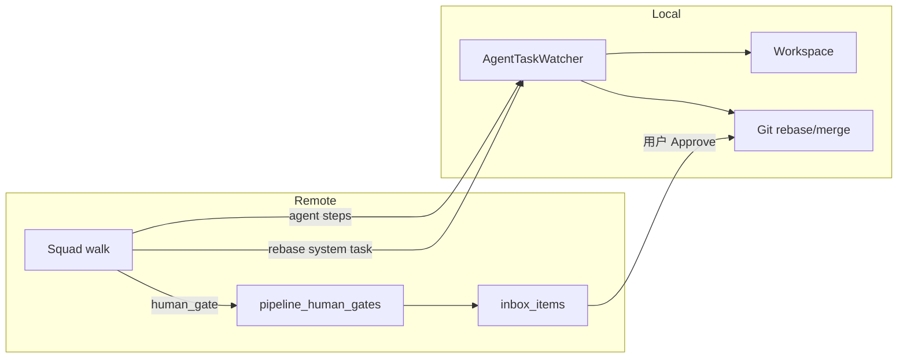

# Feature Babysitter（Feature 生命周期守护）

> 状态：一期已落地  
> 关联：Board Agents（`docs/board-agents-plan.md`）、Squad Pipeline  
> 更新：2026-07-14

## 0. 一句话定位

把「指派 Agent/Squad → 人盯着审测 rebase merge」升级为：

**挂上 Feature Babysitter Squad → 自动实现 / 验收追问 / rebase → Inbox 问你是否合并。**

人介入压缩为两处：开工前确认需求；结束时点合并。

## 1. 问题

| 痛点 | 现状 |
|------|------|
| 完成度偏差 | 一次跑完常漏边界/测试；多轮追问能补齐，但要人手跟 |
| Review / 测试 | 手动开 Review / 自己跑测 |
| Rebase | 手动点 git rebase |
| Merge | 手动判断时机 |
| 介入成本 | 整条链路都要盯 |

已有积木：Issue 挂 Agent/Squad、Squad DAG（agent/if/while/fork…）、Inbox、local rebase/merge API、session follow-up。缺的是**写完之后的固定生命周期**。

## 2. 目标闭环

```
Implement → Verify(review+test) → while(!READY) { Fix → Verify } → Rebase → Inbox「合并？」
```

| 阶段 | 谁做 | 人是否介入 |
|------|------|------------|
| Implement | Coding agent | 否 |
| Verify | Reviewer agent（对照 AC + 要求跑测） | 否（输出 `BABYSITTER_VERDICT`） |
| Ask+Fix 循环 | while + Fix agent | 否（最多 N 轮） |
| Rebase | 系统节点 → local watcher 调 git | 冲突时 Inbox 通知 |
| Merge gate | Inbox `merge_approval` | **是** — Approve 调 local merge |

**不自动 merge**（默认安全）。

## 3. 产品形态

### 3.1 内置 Squad 模板「Feature Babysitter」

一键生成 pipeline（可改 agent / 轮数）：

1. **Implement** — `agent`，实现 Issue  
2. **Verify** — `agent`，强制输出 `BABYSITTER_VERDICT: READY` 或 `NEEDS_WORK: …`  
3. **While** `verdict:needs_work`（默认 max 3）  
   - body: **Fix** → **Verify**  
   - exit: 进入 rebase  
4. **Rebase** — 新节点类型 `rebase`  
5. **Merge gate** — 新节点类型 `human_gate`（merge_approval）

用法：Agents → 新建/编辑 Squad →「应用 Feature Babysitter 模板」→ 指派到 Issue 或 Run。

### 3.2 新 Pipeline 节点

| 类型 | 行为 |
|------|------|
| `rebase` | 入队系统任务；local `AgentTaskWatcher` 对上一成功步的 workspace 执行 rebase onto target_branch；冲突 → task failed + Inbox |
| `human_gate` | 写 `pipeline_human_gates` + Inbox；walk 轮询至 approved/rejected；approved 走出边，rejected 停或走 `false` |

### 3.3 验收约定（Completeness）

Verify / Fix 的 step prompt 要求最终评论含：

```
BABYSITTER_VERDICT: READY
```

或

```
BABYSITTER_VERDICT: NEEDS_WORK: <清单>
```

`eval_condition` 支持：

- `verdict:ready`
- `verdict:needs_work`

实现：`await_agent_task` 把近期 Issue 评论拼进 summary，供 while/if 匹配。

### 3.4 Inbox

| type | 动作 |
|------|------|
| `merge_approval` | **合并** → local `POST /api/workspaces/{id}/git/merge` + respond approved；**拒绝** → respond rejected |
| `rebase_conflict` | 只读通知（可后续加「丢给 agent 解冲突」） |
| `agent_task` | 保持原样 |

## 4. 架构



原则：

- Remote **不**直连 local git；rebase 由 watcher 认领系统任务完成。  
- Merge 由**浏览器**在用户确认后打 local API（桌面在线）。  
- Squad walk 仍为同步 await（与现有 agent 步一致）；human_gate 默认超时 24h（`HUMAN_GATE_TIMEOUT_SECS`）。

## 5. 数据与 API

### 5.1 `pipeline_human_gates`

| 列 | 说明 |
|----|------|
| id, project_id, issue_id, squad_id | 关联 |
| gate_kind | `merge_approval` / `completeness_qa`（预留） |
| local_workspace_id | merge 目标 |
| question, status | pending / approved / rejected / expired |
| decision_note, decided_by, decided_at | 决策 |

### 5.2 HTTP

- `POST /v1/pipeline-gates/{id}/respond` `{ decision: "approve"|"reject", note? }`  
- Inbox payload 含 `gate_id`、`local_workspace_id`、`repo_ids?`

### 5.3 系统任务约定

`execution_prompt` 首行：

```
__VK_SYSTEM_ACTION__:rebase
workspace_id:<uuid>
```

Watcher 识别后不跑 coding agent，直接 git rebase。

## 6. 分期

### 一期（已落地）

- [x] 规划文档
- [x] 节点 `rebase` / `human_gate` + walk
- [x] `pipeline_human_gates` + respond API
- [x] Watcher：系统 rebase + 冲突 Inbox
- [x] `verdict:*` 条件 + Verify/Fix 默认 prompt
- [x] Feature Babysitter 模板按钮
- [x] Inbox 合并/拒绝 UI

### 二期（可后做）

- 真 `ReviewRequest` 节点（非 agent 角色扮演）  
- `ScriptContext::TestScript` 硬门禁  
- Completeness 改为 Inbox 问答（人答 checklist）  
- human_gate 支持飞书/推送  
- 冲突自动派 Fix agent  

### 明确不做（一期）

- 无人确认的自动 merge  
- 用 Pi/Cursor SDK 替换 coding executor  
- Remote 进程直连本机 git  

## 7. 验收口径

1. 对某 Issue 指派 Feature Babysitter Squad，能走完 Implement→Verify→（可选 Fix 循环）→Rebase→Inbox。  
2. Verify 输出 `NEEDS_WORK` 时 while 进入 Fix；`READY` 时退出循环。  
3. Rebase 成功则继续；冲突出现 Inbox，pipeline 该支失败可观测。  
4. Inbox「合并」在 local 在线时合并 workspace；「拒绝」结束 gate 且不合并。  
5. 全程除 merge 确认外无需人手点 rebase/review。  

## 8. 风险

| 风险 | 缓解 |
|------|------|
| Verify 漏写 verdict | prompt 强约束；无 verdict 时 while 把 completed 当 soft ready（与现有 soft true 一致），并在 run log 警告 |
| Merge 时 local 离线 | Inbox 保留；提示需桌面在线 |
| Walk 阻塞 HTTP | 与现有 squad run 相同；长跑靠超时 env |
| 多 repo workspace | rebase/merge 遍历 workspace_repos |

## 9. 关键代码入口

```
crates/api-types/src/squad.rs
crates/remote/src/routes/squads.rs
crates/remote/src/routes/pipeline_gates.rs   # 新增
crates/remote/migrations/*_pipeline_human_gates.sql
crates/local-deployment/src/agent_task_watcher.rs
packages/web-core/src/pages/agents/ProjectInboxPage.tsx
packages/web-core/src/pages/agents/squadPipelineFromChat.ts
packages/web-core/src/pages/agents/SquadPipeline{Editor,Canvas}.tsx
```
